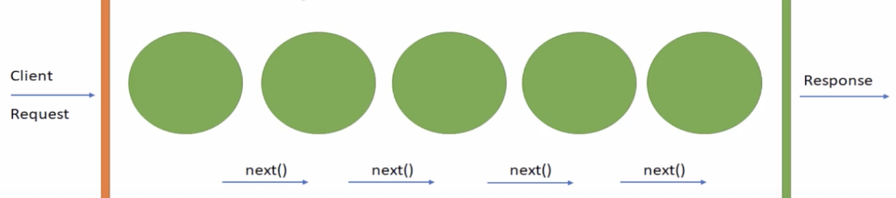

### Express中间件

**中件间**可以完成的任务

* 执行任何代码
* 对请求和响应对象进行更改
* 结束请求/响应循环
* 调用堆栈中的下一个中间作。



```
function myMiddlewate(req,res,next) {
	next()
}
```

```
const express = require('express')
const app = express()
const port = 3000

// 中间件
function myLogger(req,res,next) {
  console.log('LOGGED');
  next();
}
// 记如请求时间
function requestTime(req,res,next) {
  console.log('time')
  req.requestTime = Date.now()
  next()
}
// 请求响时间
function responseTime(req,res,next) {
  console.log('response')
  const duration = new Date() - req.requestTime
  res.setHeader('x-Response-Time',duration)
  next()
}
app.use(requestTime);
app.use(myLogger)
app.use(responseTime)
app.get('/',(req,res) => {
  res.send('hello world!' + req.requestTime);
})
app.get('/test',(req,res) => {
  const query = req.query
  const headers = req.headers
  res.download('ReadMe.md')
})


app.listen(port, ()=> {
  console.log(`Example app listening at http://localhost:${port}`)
})
```
