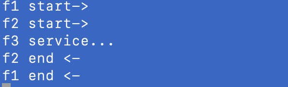

### Koa2中间件

*再次理解express中间件*

```
f1 (req,res){
	console.log('f1 start ->),
	f2(req,res) {
		console.log('f2 start ->')
		f3 (req,res) {
			console.log('f3 service...')
			res.send('Hello world!')
		}
	}
}
```

对错误捕获处理直来很不友好，每个回调都有一个新调用栈，因此你没有法对一个

callback做try catch 捕获，你需要在callback里做错误捕获，然后一层一层的向外传

递。

```

async function f1(ctx,next) {
  console.log('f1 start->');
  await next();
  console.log('f1 end <-');
}
async function f2(ctx,next) {
  console.log('f2 start->');
  await next();
  console.log('f2 end <-');
}
async function f3(ctx,next) {
  console.log('f3 service...');
  await next();
}
app.use(f1)
app.use(f2)
app.use(f3)
```




### 响应机制是不同

Express: 我们直接操作的是res对象，直接res.send()之后就立响应了

Koa2:数据的响应是通过ctx.body进行设置，注意这里仅是设置并没有立即响应，

而是在所有的中间件结束之后做了响应。
