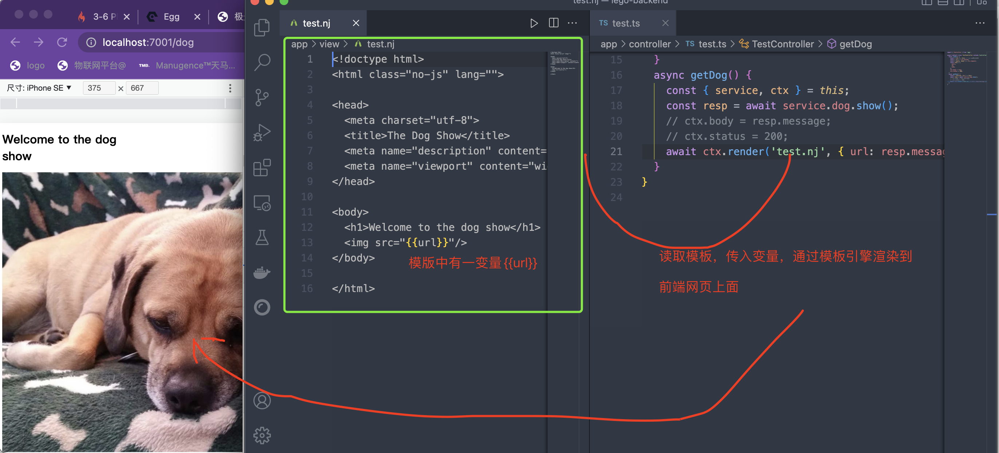

### Plugin

插件保证egg可以有**有丰富的扩展机制和可定制性**

可以保证框架核心足够精简/稳定/高效还可以促进业务逻辑的复用，生态圈的形成。

* Egg.js社区插件列表：https://github.com/topics/egg-plugin
* Egg.js的内置插件列表: https://eggjs.org/zh-cn/basics/plugin.html

## 为什么要插件

我们在使用 Koa 中间件过程中发现了下面一些问题：

1. 中间件加载其实是有先后顺序的，但是中间件自身却无法管理这种顺序，只能交给使用者。这样其实非常不友好，一旦顺序不对，结果可能有天壤之别。
2. 中间件的定位是拦截用户请求，并在它前后做一些事情，例如：鉴权、安全检查、访问日志等等。但实际情况是，有些功能是和请求无关的，例如：定时任务、消息订阅、后台逻辑等等。
3. 有些功能包含非常复杂的初始化逻辑，需要在应用启动的时候完成。这显然也不适合放到中间件中去实现。

综上所述，我们需要一套更加强大的机制，来管理、编排那些相对独立的业务逻辑。

[http:nunjucks.bootcss.com]()

你曾经一直在寻觅的 JavaScript 模板引擎就在这里！

* **功能丰富**且强大，并支持块级继承（block inheritance）、自动转义、宏（macro）、异步控制等等。完美继承了 [jinja2](http://jinja.pocoo.org/) 的衣钵。
* **快速 & 干练** 并且高效。运行时代码经过压缩之后只有 8K 大小， 可在浏览器端执行预编译模板。
* **可扩展** 性超强，用户可以自定义过滤器（filter）和扩展模块。
* **到处** 可运行，无论是 node 还是任何浏览器都支持，并且还可以预编译模板。

**npm install egg-view-nunjucks --save**

### 安装完插件，都在需要在config/plugin.ts进行启用配置：

```
import { EggPlugin } from 'egg';

const plugin: EggPlugin = {
  nunjucks: {
    enable: true,
    package: 'egg-view-nunjucks',
  },
};

export default plugin;
```


