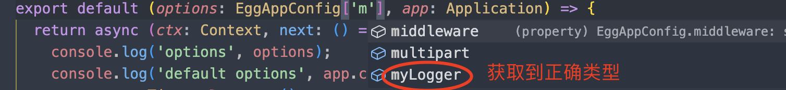

**配置需要完美支持几种文件**

* 在controller和service当中能够获取正确的类型，需支持多级提示，并自动关联。
* 在其他的配置文件中能够获得default中的正确类型。
* 在中间件中可以获取对应配置，并且可以自动提示。

  ```
    return {
      ...config as {},
      ...bizConfig,
    };
  ```

断言成空对象，这样就不会是any类型了。在其他地方就获取正确的类型。


