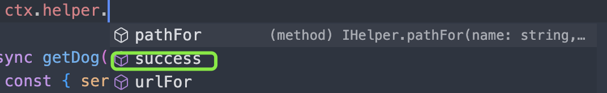

### Extend扩展

**几个重要的概念的回顾**

* Application - 全局对应的对象，只有一个实例
* Context - 上下文对象，每次请求生成一个实例
* Request - 请求对象，来自koa
* Response - 响应对象，来自Koa
  ***一个新的对象***
* Helper - 用来提供一些实用的utility 函数，框架内置了几个简单的Helper函数


```
import { Context } from 'egg';
interface RespType {
  ctx: Context;
  res?: any;
  msg?: string;
}
export default {
  success({ ctx, res, msg }: RespType) {
    ctx.body = {
      error: 0,
      data: res ? res : null,
      message: msg ? msg : '请求成功',
    };
    ctx.status = 200;
  },
};
```

---

```
{
"error": 0,
"data": {
"query": {
"a": "b"
},
"id": "12",
"body": { },
"baseUrl": "local.url"
},
"message": "请求成功"
}
```

---



# [注意约束条件建的目录必须是在app下新建一个名字为extend的目录，要扩展helper就必创建一个helper.ts文件进行扩展。]()
