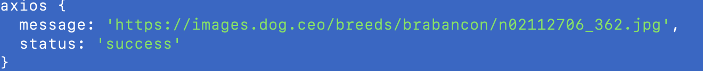

#### Extend扩展

几个重要的概念的回顾

* Application - 全局应用对象，只有一个实例

  * ctx.app
  * controller 和 service 通过 this.app 访问
  * middleware 可以传入的参数拿到
* Context - 上下文对象，每次请求生成一个实例

  * controller 和 service 通过this.ctx 访问
  * middleware 可以传入的参数拿到
* Request - 请求对象，来自koa

  * ctx.request
* Response - 响应对象，来自Koa

  * ctx.response

  ***一个新的对象***
* Helper - 用来提供一些实用的utility 函数，框架内置了几个简单的Helper函数

# Symbol

symbol是一种基本的数据类型(primitive data type). Symbol()函数会返回symbol类型的值，

该类型具有静态属性和静态方法。它的静态属必会暴露几个内建的成员对象；它的静态方法

会暴露全局的symbol注册，且类似于内建对象类，但作为构造函数来说它并不完整，因为它不

支持语法：new Symbol()

每个从Symbol()返回的symbol值都是唯一的。一个symbol值能作为对象属性的标识符；这是

该类数据类型仅有的目的。

```
import { Application } from 'egg';
import axios, { AxiosInstance } from 'axios';
const AXIOS = Symbol('Application#axios');
export default {
  // 扩展application 一个方法
  echo(msg: string) {
    const that = this as Application;
    return `hello${msg} ${that.config.name}`;
  },
  // 扩展application 一个属性
  get axiosInstance(): AxiosInstance {
    if (!this[AXIOS]) {
      this[AXIOS] = axios.create({
        baseURL: 'https://dog.ceo/',
        timeout: 5000,
      });
    }
    return this[AXIOS];
  },
};
```

---


测调用如下：

```
    const res = await this.app.axiosInstance.get('/api/breeds/image/random');
    console.log('axios', res.data);
```


