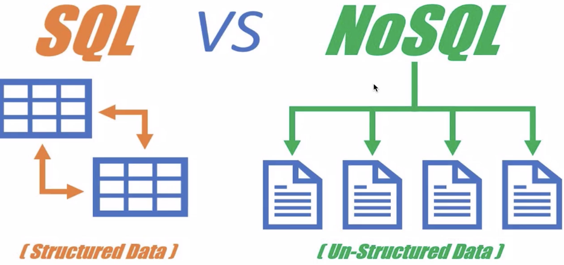
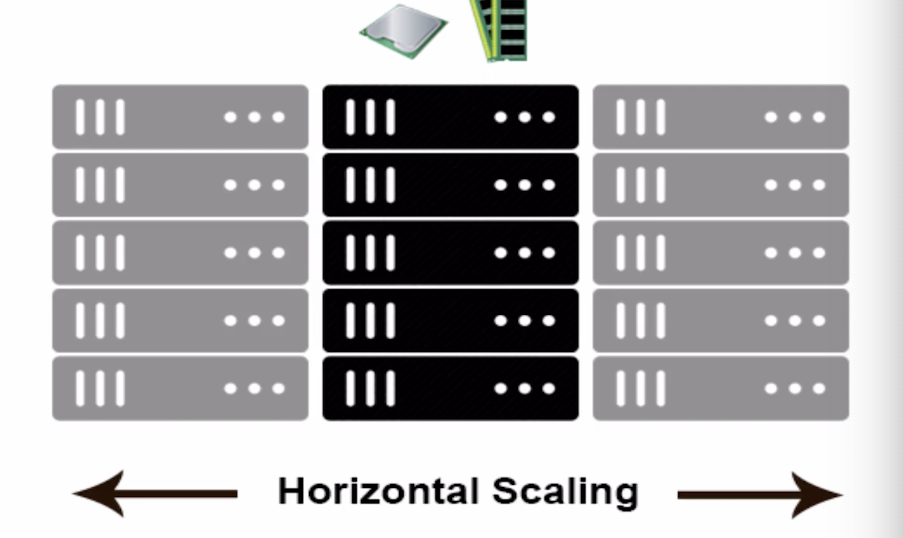

### 数据库类型的分类

简单来说，两大类，关系型数据加（SQL) 和非关系型数据库（noSQL)

**关系型数据库**

关系型数据库是指采用了关系模型来组织数据的数据库。

* 简单来说，关系模式就是二维表格模型
* 按照结构化的方法存储数据，每个数据表都必须对各个字段定义好。
  （predefined schema）
* 使用SQL 语言来进行通讯
* 纵向扩展

  
* 主要代表： MySQL, SQL Server

**非关系型数据库**

NoSQL仅仅是一个概念，泛指非关系的数据库，区别于关系数据库。

* 灵活的数据模型。
* 横向扩展
* 代表
  * 文档存储 - MongoDB
  * key value 存储 - Redis
  * 图存储 - Neo4J

**技术选型**

* 在作品(work)信息中，有大量可变的非结构化数据，使用JSON来存储最好方案。
* 针对前端工程师，不需要另外学习SQL 语句，更加友好和易上手。学习成本低。
* 免费
* 采用mongoDB https: //www.mongodb.com/ 作为数据库。
