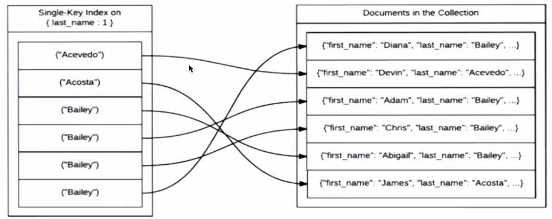

# MongoDB索引

**索引（index), 为了提高查询效率**

MongoDB文件类型： BSON, BinaryJSON, 主要被用作MongoDB数据库中的

数据库存储和网络传输格式。

假如没有索引，必须扫描这个巨大BSON对象集合上每个文档并选择那些符合

查询条件的记录，这样是低效的。

索引是特殊的数据结构，索引存储在一个易于遍历读的数据集合中。

演示MongoDB 大数据创建索引，备100万笔数据来作测试

```
    // 索引 mongoDB index
    const testCollection = db.collection('test_table1');
    // let testArr = [];
    // for (let i = 1; i <= 1000000; i++) {
    //   testArr.push({ type: 'XXX', name: `测试数据XXX${i}`, age: i });
    // }
    // const result = await testCollection.insertMany(testArr);
    // console.log(result);

    // 作一个查询测试（未创建索引）在100万笔中，查询后一笔记录 需要：23 毫秒 扫描100万个
    // const result = await testCollection.find({name: '测试数据XXX1000000'}).explain()
    // 根据系统自动创索引_id 进行查询 "_id" : ObjectId("633fd0a7f940d86a19652538") 需要： 0 扫描 1个
    const result = await testCollection.find({_id: new ObjectId('633fd0a7f940d86a19652538')}).explain()
    // 打印查询结果并分析，所需消耗时间
    console.log(result)
```


