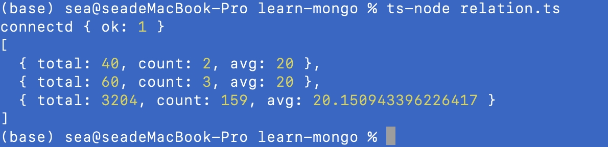

### 聚合

聚合操作是将来自多个文档的值组合在一起，并且可以对分组数据执行各

种操作以后相应的结果。

#### linux常用管道写法

* ps aux | grep mongo

#### 聚合常用操作符

* $group 将collection中的document分组，可用于统计结果
* $match过滤数据，只输出符合结果的文档
* $project 修改入文档的结构（例如重命名，增加/删除字段/ 创建结算结果等）
* $sort将结果进行排序后输出
* $limit限制管道输出的结果个数
* $skip 跳过制定数量的结果，并且返回乘下的结果

#### 表达式操作符

* $sum 计算总，{sum: 1} 表示返回总和x1的值（  即总和的数量），
  使用{sum:'$制定字段'}也能直接获取制定字段的值的总和
* $avg 求平将值
* $min 求min值
* $max 求max值
* $push将结果文插入到一个数组中
* $first根据文档的排序获了第一个文档数据
* $last同理，获取最后一个数据

```

    // 聚合测试
    const teamCollection = db.collection('team');
    const userCollection = db.collection('user');
    const pipeLine = [
      { $match: { age: { $lt: 40 } } },
      {
        $group: {
          _id: '$team',
          total: { $sum: '$age' },
          count: { $sum: 1 },
          avg: { $avg: '$age' },
        },
      },
      { $sort: { total: 1 } },
    ];
    const results = await userCollection
      .aggregate(pipeLine)
      .project({ _id: 0 })
      .toArray();
    console.log(results);
```

#### 执行结果如下所示：


