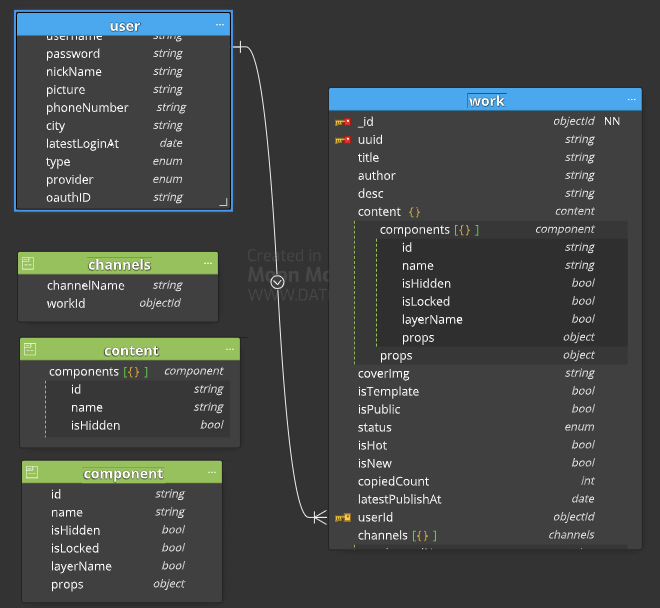

**one to few: 一个对几个：推荐使用内嵌的的形式**

```
{
	_id: ObjectID('BBB'),
	name: 'my work',
	channels: [
		{ name: '微信' },
		{ name: 'QQ' },
		{ name: '支付宝' }
	]
}
```

**on to many : 一个对很多个： 使用引用的形式**

* 第一种，在子集合中，使用一个字保存父集合的_id

  ```
  // work 1
  {
  	_id: ObjectID(BBB),
  	name: 'my work',
  	...
  	user: ObjectID('AAA')
  }
  // work 2
  {
  	_id: ObjectID(CCC),
  	name: 'my work',
  	...
  	user: ObjectID('AAA')
  }
  ```
* 第一种，在父集合中，使用数组保存子集的_id

  ```
  // user
  {
  	_id: ObjectID('AAA')
  	name: ' Kevin',
  	...
  	works: [
  		ObjectID(BBB),
  		ObjectID(CCC)
  	]
  }
  ```


**1对一亿**

**使用上面第一种方法，数组的个数不能完全不受控制，很容易造成单个文档大小的上限**

**Many to Many: 多对多 （用户与任务之间多对多关系，如一个用户可能有多个任务，**

**但一个任务可能有多用户来扫执行）**


用户

| 列名``        | 类型``   | 注释``                                                              |
| -------------------- | --------------- | -------------------------------------------------------------------------- |
| username``    | string`` | 手机号，邮箱，或者是``Oauth Provider + ID，eg：Gitee123456`` |
| password``    | string`` | 加密存储。只有邮箱注册登录的时候是需要的``                          |
| nickName``    | string`` | 昵称``                                                              |
| picture``     | string`` | 头像图片 url``                                                      |
| phoneNumber`` | string`` | 手机号``                                                            |
| city``        | string`` | 城市``                                                              |
| type``        | 'email'         | 'cellphone'                                                                |
| provider``    | 'gitee'         | 'github'                                                                   |
| oauthID``     | string`` | oauth 提供方的唯一标识符``                                          |

作品和模板

| 列名``            | 类型``     | 注释``                                             |
| ------------------------ | ----------------- | --------------------------------------------------------- |
| uuid``            | string``   | 短链接 uuid ，h5 url 中使用，隐藏真正的 id``       |
| title``           | string``   | 标题``                                             |
| desc``            | string``   | 副标题，描述``                                     |
| content``         | object``   | 内容数据 { components: [], props: {} }``           |
| author``          | string``   | 作者 username``                                    |
| coverImg``        | string``   | 缩略图 url``                                       |
| status``          | int``      | 状态：0-删除，1-未发布，2-发布，3-管理员强制下线`` |
| isTemplate``      | boolean``  | true 模板， false 非模板``                         |
| isHot``           | boolean``  | 是否 hot ，默认 false，模板用``                    |
| copiedCount``     | int``      | 被复制的次数``                                     |
| isPublic``        | boolean``  | 是否公开到首页，默认 false ，模板用``              |
| user``            | ObjectID`` | 作者的 ID，链接到用户表``                          |
| latestPublishAt`` | Date``     | 最后发布的时间``                                   |


