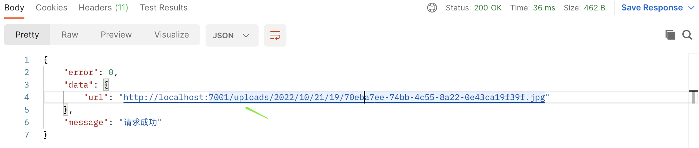

### 上传文件的controller

* 1.配置config.default.ts

```javascript
  config.multipart = {
    mode: 'file', // 上传文件模式为 file, stream
    tmpdir: join(appInfo.baseDir, 'uploads'), // 定义上传文件存放的目录
  };
  config.static = {
    dir: [
      // 1.配置静态资源文件目录
      { prefix: '/public', dir: join(appInfo.baseDir, 'app/public') },
      // 2.配置静态资源上传文件目录
      { prefix: '/uploads', dir: join(appInfo.baseDir, 'uploads') },
    ],
  };
```

* 2.配置config.local.ts

```javascript
import { EggAppConfig, PowerPartial } from 'egg';

export default () => {
  const config: PowerPartial<EggAppConfig> = {};
  // 配置开发环境的baseUrl
  config.baseUrl = 'http://localhost:7001';
  return config;
};

```

```javascript
import { Controller } from 'egg';
export default class UtilsController extends Controller {
  async fileLocalUpload() {
    const { ctx, app } = this;
    const file = ctx.request.files[0];
    // 将文件的静态资源该问地址替换成baseUrl
    const url = file.filepath.replace(app.config.baseDir, app.config.baseUrl)
    ctx.helper.success({ ctx, res: { url } });
  }
}

```

**测试结果，如图所示**


