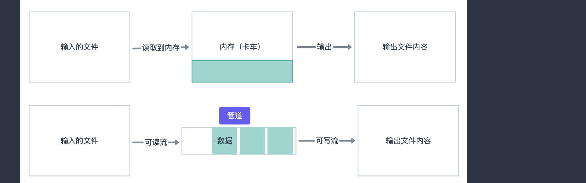

### Stream 的基础知识

Stream 的官方文档：https://nodejs.org/aip/stream.html

*流是Node.js最好，也最容易误解的概念。*

**流就是数据的集合，数据可以是字符串也可以数组，流的流程不是一次性全部获得的**



* 1. 文件 File模式：

```typescript
import { createServer } from 'http';
import { readFile } from 'fs'
const server = createServer();
server.on('request', (req,res) => {
  readFile('./big.file', (err, data) => {
    if (err) throw err;
    res.end(data)
  })
})
server.listen(8000, () => {
  console.log('http server listening at 8000 start')
})
```

* 2.Stream 文件流的模式

```typescript
import { createServer } from 'http';
import { createReadStream } from 'fs'
const server = createServer();
server.on('request', (req,res) => {
  const src = createReadStream('./big.file');
  src.pipe(res); 
})
server.listen(8000, () => {
  console.log('http server listening at 8000 start')
})
```

**Node.js支持流的内置模块**


