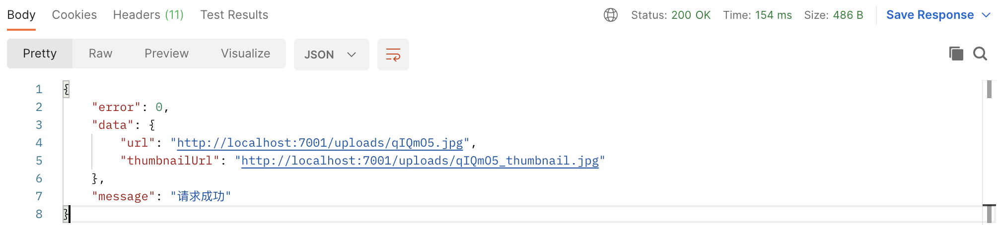

### 使用stream模式完成图上传及缩略图

```typescript
  async fileUploadByStream() {
    const { ctx, app } = this;
    // 获上传文件的文件流
    const stream = await ctx.getFileStream();
    // 取随机长度6位的uid
    const uid = nanoid(6);
    // 确定上传文件的图片路径
    const savedFilePath = join(
      app.config.baseDir,
      'uploads',
      uid + extname(stream.filename),
    );
    // 确定上传文件图片缩略图片路径
    const savedThumbnailPath = join(
      app.config.baseDir,
      'uploads',
      uid + '_thumbnail' + extname(stream.filename),
    );
    // 创建写上传图片的写入流
    const target = createWriteStream(savedFilePath);
    // 创建写上传图片缩略图的写入流
    const target2 = createWriteStream(savedThumbnailPath);
    // 用Promise方式来操作stream流读写操作
    const savePrommise = new Promise((resolve, reject) => {
      stream.pipe(target).on('finish', resolve).on('error', reject);
    });
    // 生成一个图片缩略图的转换流
    const transformer = sharp().resize({ width: 300 });
    // 让stream.pipe(到一个转换流中去).pipe(缩略图的可写流中)
    const thumbnailPromise = new Promise((resolve, reject) => {
      stream
        .pipe(transformer)
        .pipe(target2)
        .on('finish', resolve)
        .on('error', reject);
    });

    // 调用await 全部 Promise 
    await Promise.all([ savePrommise, thumbnailPromise ]);
    // 最终返回上传图片URL 及 缩略图的 thumbnailUrl
    ctx.helper.success({
      ctx,
      res: {
        url: this.pathToURL(savedFilePath),
        thumbnailUrl: this.pathToURL(savedThumbnailPath),
      },
    });
  }
```

**效果展示**


