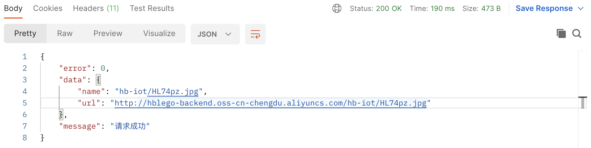

### 上传文个到阿里OSS对象存储：

```typescript
  // 上传到阿里云oss
  async uploadToOSS() {
    const { ctx, app } = this;
    // 获取上传文件流
    const stream = await ctx.getFileStream();
    // hblogo-backend/hb-iot/**.ext
    // 确定上传文传保存的路径
    const savedOSSPath = join('hb-iot', nanoid(6) + extname(stream.filename));
    // 使 try{} catch {} 处理stream文件流 上传到oss上。
    try {
      // 调用ctx.oss实例的put上传文件
      const result = await ctx.oss.put(savedOSSPath, stream);
      app.logger.info(result);
      const { name, url } = result;
      // 返回上传文件名称及 URL 地址
      ctx.helper.success({ ctx, res: { name, url } });
    } catch (error) {
      // 上传异常处理，需要注意，需将stream放到虫洞中消费掉（stream-wormhole）后
      // 再抛出异常，如果不将stream消毁掉，会一直转圈卡死
      await sendToWormhole(stream);
      // 返回error错误信息
      ctx.helper.error({ ctx, errorType: 'imageUploadFail' });
    }
  }
```

### 上传成功截图



### 上传失败的截图


