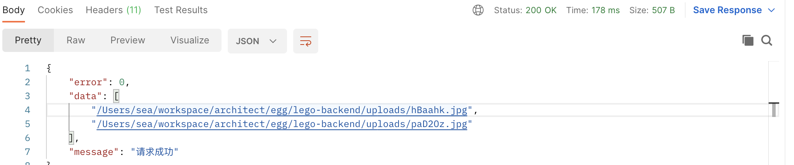

### Busboy用法示例测试

```typescript
  testBsuBoy() {
    const { ctx, app } = this;
    const busboy = new Busboy({ headers: ctx.req.headers as any });
    busboy.on('file', (filedname, file, filename) => {
      app.logger.info(filedname, file, filename);
    });
    busboy.on('field', (fieldname, val) => {
      app.logger.info(fieldname, val);
    });
    busboy.on('finish', () => {
      app.logger.info('finished');
    });
    ctx.req.pipe(busboy);
  }
```

**注意 headers 选择上传表单form data ***

### 用Busboy完成本地文件上传

```typescript
  uploadFileUseBusBoy() {
    const { app, ctx } = this;
    return new Promise<string[]>(resolve => {
      const busboy = new Busboy({ headers: ctx.req.headers as any });
      const results: string[] = [];
      busboy.on('file', (filedname, file, filename) => {
        app.logger.info(filedname, file, filename);
        const uid = nanoid(6);
        const savedFilePath = join(
          app.config.baseDir,
          'uploads',
          uid + extname(filename),
        );
        file.pipe(createWriteStream(savedFilePath));
        file.on('end', () => {
          results.push(savedFilePath);
        });
      });
      busboy.on('field', (fieldname, val) => {
        app.logger.info(fieldname, val);
      });
      busboy.on('finish', () => {
        app.logger.info('finished');
        resolve(results);
      });
      ctx.req.pipe(busboy);
    });
  }

  async testBsuBoy() {
    const { ctx } = this;
    const results = await this.uploadFileUseBusBoy();
    ctx.helper.success({ ctx, res: results });
  }
```

**展示效果**


