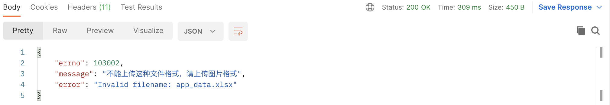
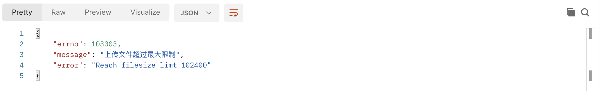

**添加上传图片的大小及格式的配置：**

```typescript
  config.multipart = {
    whitelist: [ '.png', '.jpg', '.gif', '.webp' ],
    fileSize: '100kb',
  };
```

* 修改中间的错误处理：

```typescript
import { Context } from 'egg';
export default () => {
  return async (ctx: Context, next: () => Promise<any>) => {
    try {
      await next();
    } catch (e) {
      const error = e as any;
      if (error && error.status === 401) {
        return ctx.helper.error({ ctx, errorType: 'loginValidateFail' });
      } else if (ctx.path === '/api/utils/upload') {
        if (error && error.status === 400) {
          // 上传文件格式错误报错误处理
          return ctx.helper.error({ ctx, errorType: 'imageUploadFileFormatError', error: error.message });
        }
      }
      throw error;
    }
  };
};
```

效果示展：



* 修上传文件代码：

```typescript
        try {
          const savedOSSPath = join(
            'hb-iot',
            nanoid(6) + extname(part.filename)
          );
          const result = await ctx.oss.put(savedOSSPath, part);
          const { url } = result;
          urls.push(url);
          // 上传图片大小的错误处理
          if (part.truncated) {
            await ctx.oss.delete(savedOSSPath);
            return ctx.helper.error({
              ctx,
              errorType: 'imageUploadFileSizeError',
              error: `Reach filesize limt ${fileSize}`,
            });
          }
        } catch (error) {
          // 异常将part给销毁掉
          await sendToWormhole(part);
          ctx.helper.error({ ctx, errorType: 'imageUploadFail' });
        }
```

效果展示：


