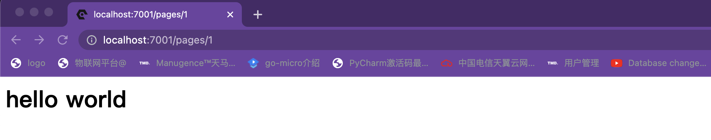

### SRR渲染示例

```typescript
  // SSR 服务端渲染H5页面
  async renderH5Page() {
    const { ctx } = this;
    const vueApp = createSSRApp({
      data: () => ({ msg: 'hello world' }),
      template: '<h1>{{msg}}</h1>',
    });
    // 渲染生成字符串
    const appContent = await renderToString(vueApp);
    ctx.response.type = 'text/html';
    ctx.body = appContent;
    // 渲染生成文个流
    const stream = renderToNodeStream(vueApp);
    ctx.status = 200;
    await pipeline(stream, ctx.res);
  }
```


