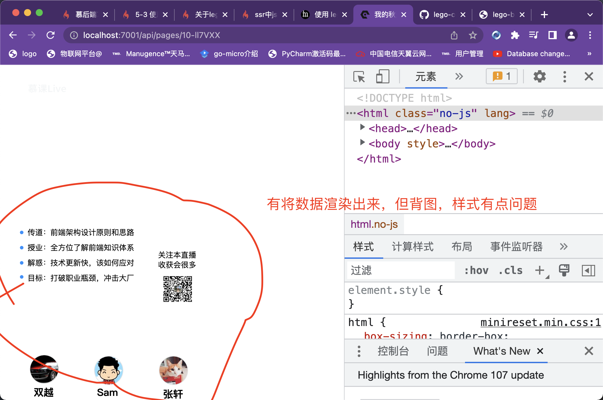

**1.安装lego-components组库**

```bash
npm install lego-componetns --save
```

**2.进行SSR服务端渲染分层，在service下新建一个utils.ts**

```typescript
import { Service } from 'egg';
import { createSSRApp } from 'vue';
import LegoComponents from 'lego-components';
import { renderToString } from '@vue/server-renderer';
export default class UtilsService extends Service {
  async renderToPageData(query: { id: number; uuid: string }) {
    const work = await this.ctx.model.Work.findOne(query).lean();
    if (!work) {
      throw new Error('work not exsit');
    }
    const { title, desc, content } = work;
    const vueApp = createSSRApp({
      data: () => {
        return {
          components: (content && content.components) || [],
        };
      },
      template: '<final-page :components="components"></final-page>',
    });
    // 全局注册lego-components组件库
    vueApp.use(LegoComponents);
    const html = await renderToString(vueApp);
    return {
      html,
      title,
      desc,
    };
  }
}
```

**3.修改controller中的renderH5Page的渲染H5页面的方法，添加一个解析参数的拼装的方法**

```typescript
  splitIdAndUuid(str = '') {
    const result = { id: 0, uuid: '' };
    if (!str) return result;
    const firstDashIndex = str.indexOf('-');
    if (firstDashIndex < 0) return result;
    result.id = parseInt(str.slice(0, firstDashIndex));
    result.uuid = str.slice(firstDashIndex + 1);
    return result;
  }
  // SSR 服务端渲染H5页面
  async renderH5Page() {
    const { ctx } = this;
    const { idAndUuid } = ctx.params;
    const query = this.splitIdAndUuid(idAndUuid);
    try {
      const pageData = await this.service.utils.renderToPageData(query);
      await ctx.render('page.nj', pageData);
    } catch (error) {
      ctx.helper.error({ ctx, errorType: 'h5WorkNotExistError' });
    }
  }
```

**4.网页上进行测试，看一下服务器渲染出来的效果**


