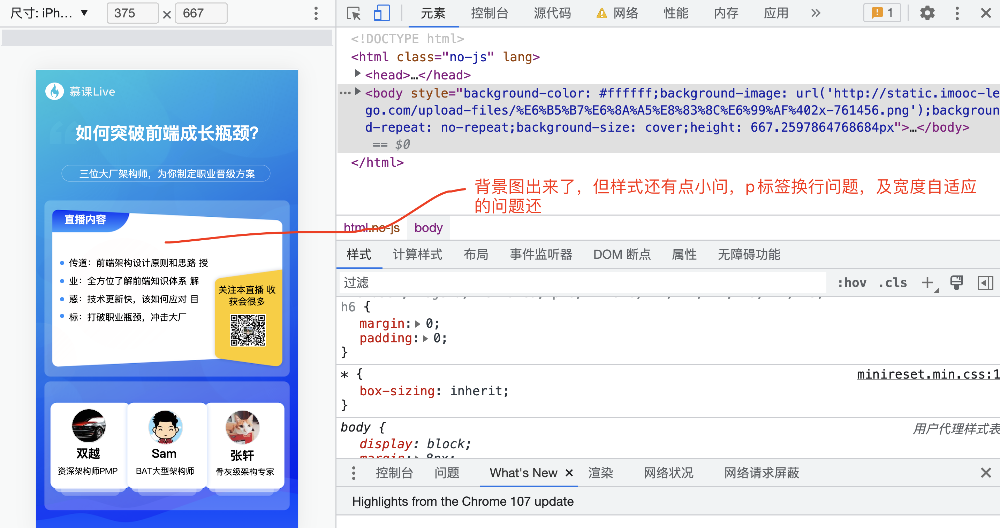

**在service 中添加一个方法来处理内联样式**

* 1.后端返回的数据

```json
        "props" : {
            "backgroundColor" : "#ffffff",
            "backgroundImage" : "url('http://static.imooc-lego.com/upload-files/%E6%B5%B7%E6%8A%A5%E8%83%8C%E6%99%AF%402x-761456.png')",
            "backgroundRepeat" : "no-repeat",
            "backgroundSize" : "cover",
            "height" : "667.2597864768684px"
        }
```

* 2.需要将这些数据转成:

```style
backgroupnd-color: "#ffffff"
```

* 3.处理方法propsToStyple 将json 转换成 style内联样式:

```typescript
  propsToStyple(props = {}) {
    const keys = Object.keys(props);
    const styleArr = keys.map(key => {
      const formatKey = key.replace(
        /[A-Z]/g,
        c => `-${c.toLocaleLowerCase()}`,
      );
      // fontSize -> font-size
      const value = props[key];
      return `${formatKey}: ${value}`;
    });
    return styleArr.join(';');
  }
```

* 4 修改模板文件添加link重置minireset.min.css样式的文件

```nj
<!doctype html>
<html class="no-js" lang="">

<head>
  <meta charset="utf-8">
  <title>{{title}}</title>
  <meta name="description" content="{{desc}}">
  <meta name="viewport" content="width=device-width, user-scalable=no, initial-scale=1.0, maximum-scale=1.0, minimum-scale=1.0">
  <meta http-equiv="X-UA-Compatible" content="ie=edge">
  <link rel="stylesheet" href="//cdn.bootcdn.net/ajax/libs/minireset.css/0.0.2/minireset.min.css">
</head>

<body style="{{bodyStyle}}">
  {{html | safe}}
</body>

</html>
```

#### 展示效果：


