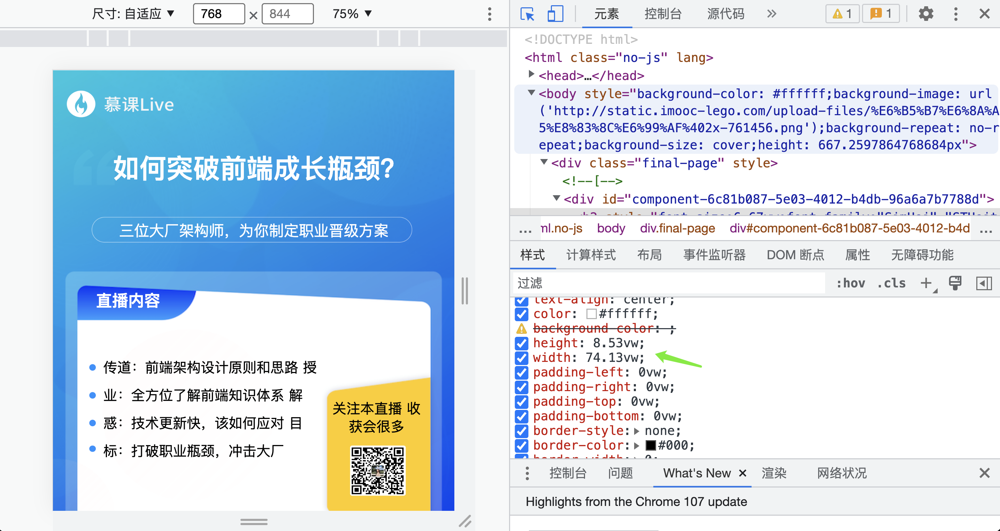

#### 在线正则表达式网站：regexr.com

* 之前使用绝位定位px象素，如果宽度发生变化，位置会发生偏移。
* 所以需要将px 转负成vw，以视器宽度进行同比缩放调整

  * 以画布宽375 做为标准
  * 25px => (25 / 375) * 100 = 0.06vw
* 在service中添加一个px2vw()方法进行转负计算处理

  ```typescript
  px2vw(components = []) {
    // '10px' '9.5px'
    const reg = /^(\d+(\.\d+)?)px$/;
    components.forEach((component: any = {}) => {
      const props = component.props || {};
      // 遍历组件的属性
      Object.keys(props).forEach(key => {
        const val = props[key];
        if (typeof val !== 'string') {
          return;
        }
        // value 中没有 px, 不是一个距离的属性
        if (reg.test(val) === false) {
          return;
        }
        const arr = val.match(reg) || [];
        const numStr = arr[1];
        const num = parseFloat(numStr);
        // 计算出 vw, 重新赋值
        // 编辑器画布宽度是 375
        const vwNum = (num / 375) * 100;
        props[key] = `${vwNum.toFixed(2)}vw`;
      });
    });
  }
  ```

  * 在renderToPageData下面进行调用

  ```typeseript
    async renderToPageData(query: { id: number; uuid: string }) {
    const work = await this.ctx.model.Work.findOne(query).lean();
    if (!work) {
      throw new Error('work not exsit');
    }
    const { title, desc, content } = work;
    // 计算处理content.components属性值（主要距离相关的属性值）
    this.px2vw(content && content.components);
    const vueApp = createSSRApp({
      data: () => {
        return {
          components: (content && content.components) || [],
        };
      },
      template: '<final-page :components="components"></final-page>',
    });
    vueApp.use(LegoComponents);
    const html = await renderToString(vueApp);
    const bodyStyle = this.propsToStyple(content && content.props);
    console.log('测试', bodyStyle);
    return {
      html,
      title,
      desc,
      bodyStyle,
    };
  }
  ```

}

#### 成功转换后


