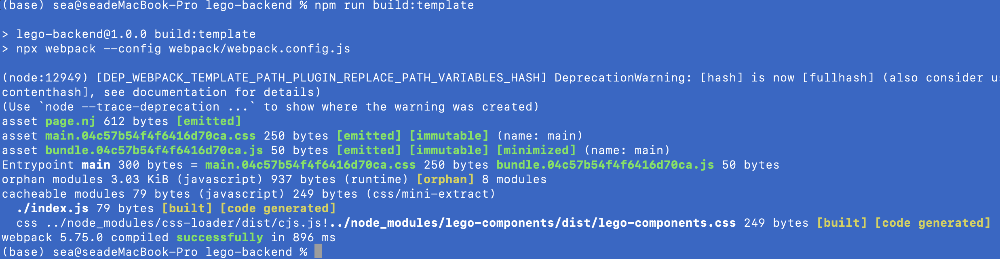

###### 首先这装相应几个插件：

* webpack
* webpack-cli
* css-loader
* html-webpack-plugin
* mini-css-extract-plugin

**配置webpack.config.js**

```javascript
/* eslint-disable @typescript-eslint/no-var-requires */
const path = require('path');
const MiniCssExtractPlugin = require('mini-css-extract-plugin');
const HtmlWebpackPlugin = require('html-webpack-plugin');
const buildFileDest = path.resolve(__dirname, '../app/public');
module.exports = {
  mode: 'production',
  context: path.resolve(__dirname, '../webpack'),
  entry: './index.js',
  output: {
    path: buildFileDest,
    filename: 'bundle.[hash].js',
    publicPath: '/public',
  },
  module: {
    rules: [
      {
        test: /\.css$/,
        use: [
          MiniCssExtractPlugin.loader,
          'css-loader',
        ],
      },
    ],
  },
  plugins: [
    new MiniCssExtractPlugin({
      filename: '[name].[hash].css',
    }),
    new HtmlWebpackPlugin({
      filename: 'page.nj',
      template: path.resolve(__dirname,'./template.html'),
    }),
  ],
};
```

**修改package.json添加scripts处理命令**

```json
  "build: template": "npx webpack --config webpack/webpack.config.js"
```json
**运行脚本**
```bash
npm run build:template
```


