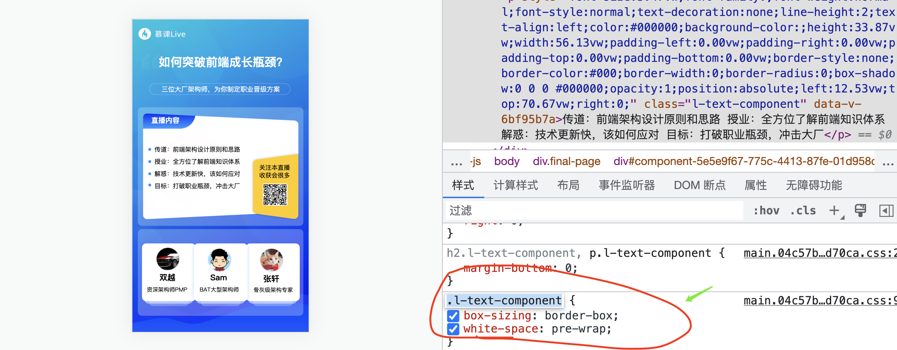

**安装一个文件管理插件来完成文件的拷贝工作**

```bash
npm install filemanager-webpack-plugin --save-dev
```

**在webpack.config.js中导入filemanager-webpack-plugin插件**

* constFileManagerPlugin=require('filemanager-webpack-plugin');

**设置需要拷贝文件目标路径**

* const templateFileDest = path.resolve(__dirname, 'app/view');

```javascript
    new FileManagerPlugin({
      events: {
        onEnd: {
          copy: [
            {
              source: path.join(buildFileDest, 'page.nj'),
              destination: path.join(templateFileDest, 'page.nj'),
            },
          ],
        },
      },
    }),
```

**安装打包发布的清理工作的插件，因为我们每次打包都会新的文件，旧的文已经没有用了**

**所以需要进行清理善后的工作。**

```bash
npm install --save-dev clean-webpack-plugin
```

**完整配置文件**

```javascript
/* eslint-disable @typescript-eslint/no-var-requires */
const path = require('path');
const MiniCssExtractPlugin = require('mini-css-extract-plugin');
const HtmlWebpackPlugin = require('html-webpack-plugin');
const { CleanWebpackPlugin } = require('clean-webpack-plugin');
const FileManagerPlugin = require('filemanager-webpack-plugin');
const buildFileDest = path.resolve(__dirname, '../app/public');
const templateFileDest = path.resolve(__dirname, '../app/view');

module.exports = {
  mode: 'production',
  context: path.resolve(__dirname, '../webpack'),
  entry: './index.js',
  output: {
    path: buildFileDest,
    filename: 'bundle.[hash].js',
    publicPath: '/public',
  },
  module: {
    rules: [
      {
        test: /\.css$/,
        use: [
          MiniCssExtractPlugin.loader,
          'css-loader',
        ],
      },
    ],
  },
  plugins: [
    new CleanWebpackPlugin(),
    new MiniCssExtractPlugin({
      filename: '[name].[hash].css',
    }),
    new HtmlWebpackPlugin({
      filename: 'page.nj',
      template: path.resolve(__dirname,'./template.html'),
    }),
    new FileManagerPlugin({
      events: {
        onEnd: {
          copy: [
            {
              source: path.join(buildFileDest, 'page.nj'),
              destination: path.join(templateFileDest, 'page.nj'),
            },
          ],
        },
      },
    }),
  ],
};
```

#### SSR 渲染效果


