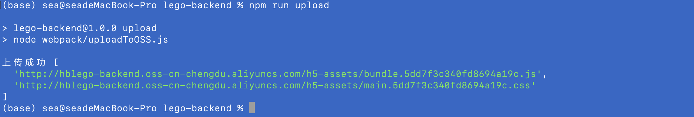
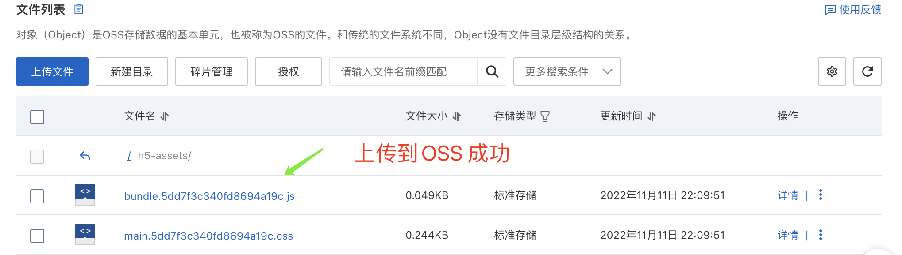

##### 添加一个上传静态文件uploadToOSS.js 脚本

```javascript
/* eslint-disable @typescript-eslint/no-var-requires */
const OSS = require('ali-oss');
const fs = require('fs');
const path = require('path');
const dovenv = require('dotenv');

// 设置环境变量
dovenv.config({ path: path.resolve(__dirname, '../.env') });
const publicPath = path.resolve(__dirname, '../app/public');
// 创建一个OSS的实例
const client = new OSS({
  accessKeyId: process.env.ALC_ACCESS_KEY || '',
  accessKeySecret: process.env.ALC_SECRET_KEY || '',
  bucket: 'hblego-backend',
  endpoint: 'oss-cn-chengdu.aliyuncs.com',
});

async function run() {
  // 从文件夹获取对应的文件列表
  const publicFiles = fs.readdirSync(publicPath);
  const files = publicFiles.filter(f => f !== 'page.nj');
  const res = await Promise.all(
    files.map(async fileName => {
      const savedOSSPath = path.join('h5-assets', fileName);
      const filePath = path.join(publicPath, fileName);
      const result = await client.put(savedOSSPath, filePath);
      const { url } = result;
      return url;
    }),
  );
  console.log('上传成功', res);
}
run();
```

#### 编写运行行脚本添加到package.json文件的scripts中

```json
"upload": "node webpack/uploadToOSS.js"
```

#### 查看上传静态文上传至OSS执行结果：




