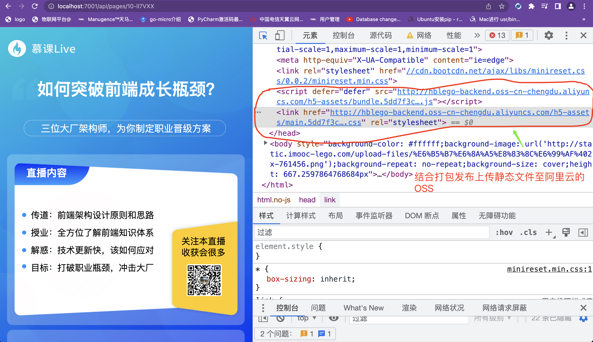

##### 1修改webpack.config.js 文件进行环境变量注入：

```javascript
/* eslint-disable @typescript-eslint/no-var-requires */
const path = require('path');
const MiniCssExtractPlugin = require('mini-css-extract-plugin');
const HtmlWebpackPlugin = require('html-webpack-plugin');
const { CleanWebpackPlugin } = require('clean-webpack-plugin');
const FileManagerPlugin = require('filemanager-webpack-plugin');
const buildFileDest = path.resolve(__dirname, '../app/public');
const templateFileDest = path.resolve(__dirname, '../app/view');

module.exports = env => {
  console.log('env', env.production);
  return {
    mode: 'production',
    context: path.resolve(__dirname, '../webpack'),
    entry: './index.js',
    output: {
      path: buildFileDest,
      filename: 'bundle.[hash].js',
      // 三元表达式根据注入环境变量进行判断是生产环境还是开发环境
      publicPath: env.production ? 'http:hblego-backend.oss-cn-chengdu.aliyuncs.com/h5-assets/' : '/public',
    },
    module: {
      rules: [
        {
          test: /\.css$/,
          use: [
            MiniCssExtractPlugin.loader,
            'css-loader',
          ],
        },
      ],
    },
    plugins: [
      new CleanWebpackPlugin(),
      new MiniCssExtractPlugin({
        filename: '[name].[hash].css',
      }),
      new HtmlWebpackPlugin({
        filename: 'page.nj',
        template: path.resolve(__dirname, './template.html'),
      }),
      new FileManagerPlugin({
        events: {
          onEnd: {
            copy: [
              {
                source: path.join(buildFileDest, 'page.nj'),
                destination: path.join(templateFileDest, 'page.nj'),
              },
            ],
          },
        },
      }),
    ],
  };
};
```

#### 修改调用脚本：

```json
  "build:template:dev": "npx webpack --config webpack/webpack.config.js",
  "build:template:prod": "npx webpack --config webpack/webpack.config.js --env production && npm run upload",
```

**这样就完成webpack打包静态文件就上传到阿里OSS中**


