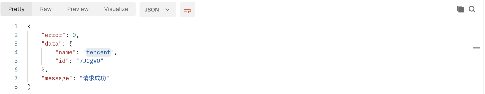
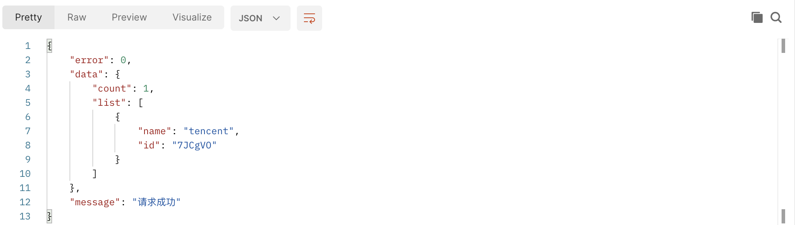

#### 1.添加渠道的interface

```typescript
// 渠道
interface ChannelProps {
  name: string;
  id: string;
}
```

#### 2.在controller中添加渠道的方法

```typescript
  // 创建渠道
  @validateInput(channelCreateRules, 'channelValidateFail')
  async createChannel() {
    const { ctx } = this;
    const { name, workId } = ctx.request.body;
    const newChannel = {
      name,
      id: nanoid(6),
    };
    await ctx.model.Work.findOneAndUpdate(
      { id: workId },
      { $push: { channels: newChannel } }
    );
    ctx.helper.success({ ctx, res: newChannel });
  }
```

#### 3. 在controller中添加获取渠道的方法

```typescript
  // 获取渠道
  async getWorkChannel() {
    const { ctx } = this;
    const { id } = ctx.params;
    const certianWork = await ctx.model.Work.findOne({ id });
    if (certianWork) {
      const { channels } = certianWork;
      ctx.helper.success({
        ctx,
        res: {
          count: (channels && channels.length) || 0,
          list: channels || [],
        },
      });
    } else {
      ctx.helper.error({ ctx, errorType: 'channelOperateFail' });
    }
  }
```

##### 添加渠道，获取渠道的路由

```typescript
  router.post('/api/channel', controller.work.createChannel);
  router.get('/api/channel/getWorkChannels/:id', controller.work.getWorkChannel);
```

#### POST 进行测试




