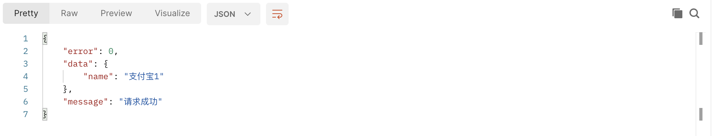
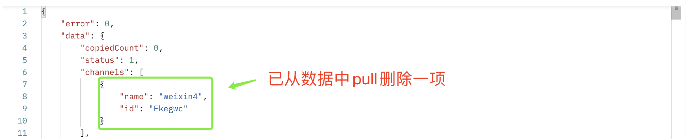

##### 1.在controller添加更新渠道的方法

```typescript
  async updateChannelName() {
    const { ctx } = this;
    const { id } = ctx.params;
    const { name } = ctx.request.body;
    const res = await ctx.model.Work.findOneAndUpdate(
      { 'channels.id': id },
      { $set: { 'channels.$.name': name } }
    );
    if (res) {
      ctx.helper.success({ ctx, res: { name } });
    } else {
      ctx.helper.error({ ctx, errorType: 'channelOperateFail' });
    }
  }
```

##### 2.在controller添加删除渠道的方法

```typescript
  // 删除渠道
  async deleteChannel() {
    const { ctx } = this;
    const { id } = ctx.params;
    const work = await ctx.model.Work.findOneAndUpdate(
      { 'channels.id': id },
      { $pull: { channels: { id } } },
      { new: true },
    );
    if (work) {
      ctx.helper.success({ ctx, res: work });
    } else {
      ctx.helper.error({ ctx, errorType: 'channelOperateFail' });
    }
  }
```

##### 3.添加更新及删除渠道的路由

```typescript
  router.patch('/api/channel/updateName/:id', controller.work.updateChannelName);
  router.delete('/api/channel/:id', controller.work.deleteChannel);
```

#### 4.用postman进行测试：




