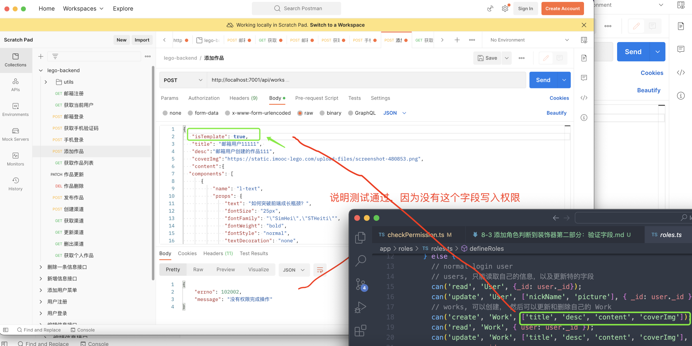

**添加字段权限控制**

```typescript
import { Controller } from 'egg';
import { GlobalErrorTypes } from '../error';
import defineRoles from '../roles/roles';
import { subject } from '@casl/ability';
import { permittedFieldsOf } from '@casl/ability/extra';
import { difference } from 'lodash';

// 将http中的方法与roles中的action作一一对应的mapping映设
const caslMethodMapping: Record<string, string> = {
  GET: 'read',
  POST: 'create',
  PATCH: 'update',
  DELETE: 'delete',
};

const options = { fieldsFrom: rule => rule.fields || [] }

export default function checkPermission(
  modelName: string,
  errorType: GlobalErrorTypes,
  _userKey = 'user'
) {
  return function (_prototype, _key: string, descriptor: PropertyDescriptor) {
    const originalMethod = descriptor.value;
    descriptor.value = async function (...args: any[]) {
      const that = this as Controller;
      // eslint-disable-next-line @typescript-eslint/ban-ts-comment
      // @ts-ignore
      const { ctx } = that;
      const { id } = ctx.params;
      const { method } = ctx.request;
      const action = caslMethodMapping[method];
      if (!ctx.state && !ctx.state.user) {
        return ctx.helper.error({ ctx, errorType });
      }
      let permission = false;
      let keyPermission = true;
      // 获取定义的 roles
      const ability = defineRoles(ctx.state.user);
      // 所以我们需要先获取role 来判断一下，看他是否存对应的条件
      const rule = ability.relevantRuleFor(action, modelName);
      console.log('rule:', rule);
      if (rule && rule.conditions) {
        // 假如存在 condition, 先查询对应的数据
        const certianRecord = await ctx.model[modelName].findOne({ id }).lean();
        permission = ability.can(action, subject(modelName, certianRecord));
      } else {
        permission = ability.can(action, modelName);
      }
      // 判断 rule 中是否有对应受限字段
      if (rule && rule.fields) {
        const fields = permittedFieldsOf(ability, action, modelName, options);
        if (fields.length > 0) {
          // 1. 过滤 request.body * (不用)
          // 2. 获取当前 payload 的keys 和 允许的 fields 做比较
          // fields 对 payloadKeys 关系应该是全部包含的关系
          const payloadKeys = Object.keys(ctx.request.body);
          const diffKeys = difference(payloadKeys, fields);
          console.log('diffKeys', diffKeys);
          keyPermission = diffKeys.length === 0;
        }
      }
      console.log('permission:', permission);
      if (!permission || !keyPermission) {
        return ctx.helper.error({ ctx, errorType });
      }
      await originalMethod.apply(this, args);
    };
  };
}

```

#### 字段权限的测试：（postman）


