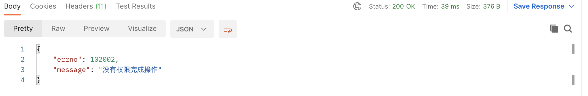

##### 1.添加自定义的Options类型

```typescript
interface IOptions {
  // 自定义 action
  action?: string;
}
```

##### 2.修改checkPerimssion方法（options?: IOptions）传入参数

```typescript
export default function checkPerimssion(
  modelName: string,
  errorType: GlobalErrorTypes,
  options?: IOptions
) {
```

##### 3. 三元表达式修改处理action

```typescript
      const action =
        options && options.action ? options?.action : caslMethodMapping[method];
```

##### 4.修改controller的调用方式。加自上自动定义的action

```typescript
  // 发布
  @checkPerimssion('Work', 'workNoPermissonFail', { action: 'publish'})
  async publish(isTemplate: boolean) {
    const { ctx } = this;
    const url = await ctx.service.work.publish(ctx.params.id, isTemplate);
    ctx.helper.success({ ctx, res: { url } });
  }
```

##### 测试只你自己可以发自己的作品




##### 处理casl与mongoose的对应关系

```typescript

```
