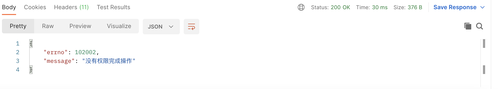
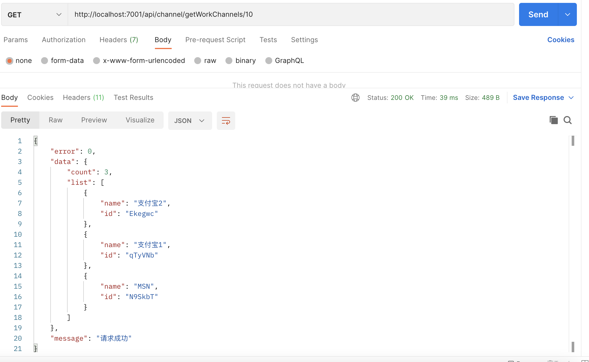

##### 1.添加函数据参数的注解说明

```typescript
// { id: ctx.params.id }
// { 'channels.id' : ctx.params.id }
// { 'channels.id' : ctx.request.body.workID }
/**
 *
 * @param modelName model 的名称，可以是普通的字符串，也可以是 casl 和 mongoose 的映射关系
 * @param errorType 返回的错误类型，来自 GlobalErrorTypes
 * @param options 特殊配置选项，可以自定义 action 以及查询条件，详见上面的 IOptions 选项
 * @return function
 */
export default function checkPermission(
  modelName: string | ModelMapping,
  errorType: GlobalErrorTypes,
  options?: IOptions
) {
  return function (_prototype, _key: string, descriptor: PropertyDescriptor) {
    const originalMethod = descriptor.value;
    descriptor.value = async function (...args: any[]) {
      const that = this as Controller;
      ------
  }
```

##### 2.定义一个预设的defaultSearchOptions

```typescript
const defaultSearchOptions = {
  key: 'id',
  value: { type: 'params', valueKey: 'id' },
};
```

***注意我们使用lodash/fp的 assign进行混，这样就修改我们传入参数***

```typescript
import { difference, assign } from 'lodash/fp';
```

##### 3.接下来我们用assign方法来处理他，从后往前进行，用options来覆盖defaultSearchOptions

```typescript
// 如果options 不存就用一个空对象 { }
const searchOptions = assign(defaultSearchOptions, options || {});
```

##### 4.从searchoptions取出相应的值来

```typescript
      const { key, value } = searchOptions;
      const { type, valueKey } = value;
```

##### 5.构建一个query

```typescript
      // 构建一个 query
      const source = type === 'params' ? ctx.params : ctx.request.body;
      const query = {
        [key]: source[valueKey],
      };
```

##### 6.修改之前modelName

```typescript
      // 构建 modelname
      const mongooseModelName =
        typeof modelName === 'string' ? modelName : modelName.mongoose;
      const caslModelName =
        typeof modelName === 'string' ? modelName : modelName.casl;
      const action =
        options && options.action ? options.action : caslMethodMapping[method];
      console.log(action);
      if (!ctx.state && !ctx.state.user) {
        return ctx.helper.error({ ctx, errorType });
      }
      let permission = false;
      let keyPermission = true;
      // 获取定义的 roles
      const ability = defineRoles(ctx.state.user);
      // 所以我们需要先获取 rule 来判断一下，看他是否存在对应的条件
      const rule = ability.relevantRuleFor(action, caslModelName);
      if (rule && rule.conditions) {
        // 假如存在 condition，先查询对应的数据
        const certianRecord = await ctx.model[mongooseModelName]
          .findOne(query)
          .lean();
        permission = ability.can(action, subject(caslModelName, certianRecord));
      } else {
        permission = ability.can(action, caslModelName);
      }
```

##### 7.修改测试我们@checkPermission()方法

```typescript
  // 创建渠道
  @validateInput(channelCreateRules, 'channelValidateFail')
  @checkPermission(
    { casl: 'Channel', mongoose: 'Work' },
    'workNoPermissonFail',
    { value: { type: 'body', valueKey: 'workId' } }
  )
  async createChannel() {
    const { ctx } = this;
    const { name, workId } = ctx.request.body;
    const newChannel = {
      name,
      id: nanoid(6),
    };
    const res = await ctx.model.Work.findOneAndUpdate(
      { id: workId },
      { $push: { channels: newChannel } }
    );
    if (res) {
      ctx.helper.success({ ctx, res: newChannel });
    } else {
      ctx.helper.error({ ctx, errorType: 'channelOperateFail' });
    }
  }
  // 获取渠道
  @checkPermission({ casl: 'Channel', mongoose: 'Work' }, 'workNoPermissonFail')
  async getWorkChannel() {
    const { ctx } = this;
    const { id } = ctx.params;
    const certianWork = await ctx.model.Work.findOne({ id });
    if (certianWork) {
      const { channels } = certianWork;
      ctx.helper.success({
        ctx,
        res: {
          count: (channels && channels.length) || 0,
          list: channels || [],
        },
      });
    } else {
      ctx.helper.error({ ctx, errorType: 'channelOperateFail' });
    }
  }
  // 更新渠道
  @checkPermission(
    { casl: 'Channel', mongoose: 'Work' },
    'workNoPermissonFail',
    { key: 'channels.id' }
  )
  async updateChannelName() {
    const { ctx } = this;
    const { id } = ctx.params;
    const { name } = ctx.request.body;
    const res = await ctx.model.Work.findOneAndUpdate(
      { 'channels.id': id },
      { $set: { 'channels.$.name': name } }
    );
    if (res) {
      ctx.helper.success({ ctx, res: { name } });
    } else {
      ctx.helper.error({ ctx, errorType: 'channelOperateFail' });
    }
  }
  // 删除渠道
  @checkPermission(
    { casl: 'Channel', mongoose: 'Work' },
    'workNoPermissonFail',
    { key: 'channels.id' }
  )
  async deleteChannel() {
    const { ctx } = this;
    const { id } = ctx.params;
    const work = await ctx.model.Work.findOneAndUpdate(
      { 'channels.id': id },
      { $pull: { channels: { id } } },
      { new: true }
    );
    if (work) {
      ctx.helper.success({ ctx, res: work });
    } else {
      ctx.helper.error({ ctx, errorType: 'channelOperateFail' });
    }
  }
```

##### 用POSTMAN进行测试通过





