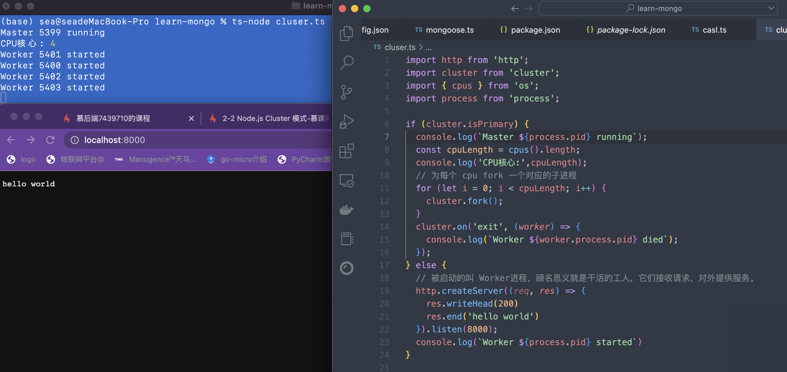

##### Egg.js Cluster 模型的原理

Egg.js 关于这部分内容的文档：https://eggjs.org/zh-cn/core/cluster-and-ipc.html

**为什么要采用Cluster模式**

Javascript代码是运行在单线程上的。那么如果用Node.js来做Web Sever, 就无法享受到多核运算的好处。

**什么是Cluster模式**

文档: http://nodejs.cn/api/cluster.html

Node.js的单个实例在单个线程中运行，为了利多核系统，用户有时会想要启动多个Node.js进程的集群来处理负载

* 在服务器上同时启动多个进程
* 每个进程里都跑的同一份源代码（将一个进程的工作分给多个进程去做）
* 这些进程可以同时监听一个端口



```typescript
import http from 'http';
import cluster from 'cluster';
import { cpus } from 'os';
import process from 'process';

if (cluster.isPrimary) {
  console.log(`Master ${process.pid} running`);
  const cpuLength = cpus().length;
  console.log('CPU核心:',cpuLength);
  // 为每个 cpu fork 一个对应的子进程
  for (let i = 0; i < cpuLength; i++) {
    cluster.fork();
  }
  cluster.on('exit', (worker) => {
    console.log(`Worker ${worker.process.pid} died`);
  });
} else {
  // 被启动的叫 Worker进程，顾名思义就是干活的工人，它们接收请求，对外提供服务。
  http.createServer((req, res) => {
    res.writeHead(200)
    res.end('hello world')
  }).listen(8000);
  console.log(`Worker ${process.pid} started`)
}
```
