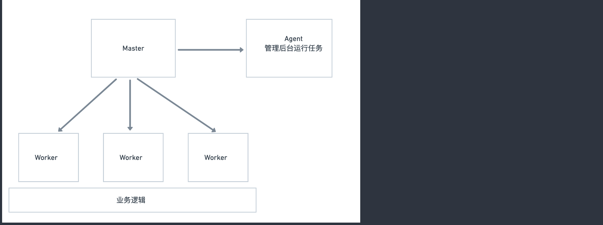

##### Egg.js start  的时候启动的进程

Egg.js 关于这个部分的内容的文档: https://eggjs.org/zh-cn/core/cluster-and-ipc.html

* 使用egg-scripts 启动 master process
* 使用egg-cluster 启动和cpu核数相等的app_worker process
* 使用egg-cluster 启动的一个独特的agent_worker process

##### 进行守护
考虑到生产环境的健状性，必须保谈不上进程异常的情况下怎了样处理。
**当代码抛出异常的并没有捕获的时候**, worker使用process.on('uncaughtException',handler)
捕获对应的错误，这个时候该进程以及处于不确定的状态，需要优雅退出。
+---------+                 +---------+
   |  Worker |                 |  Master |
   +---------+                 +----+----+
        | uncaughtException         |
        +------------+              |
        |            |              |                   +---------+
        | <----------+              |                   |  Worker |
        |                           |                   +----+----+
        |        disconnect         |   fork a new worker    |
        +-------------------------> + ---------------------> |
        |         wait...           |                        |
        |          exit             |                        |
        +-------------------------> |                        |
        |                           |                        |
       die                          |                        |
                                    |                        |
                                    |                        |
