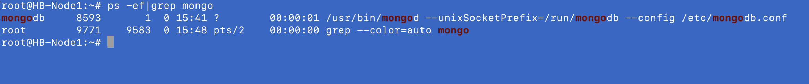

* * nodejs
  * mongodb
  * redis
  * git

##### 关於安装Nodejs 采用NVM 的方式：

* 下载wget  https://github.com/nvm-sh/nvm/archive/refs/tags/v0.39.2.tar.gz
* 解压安装包 tar -zxvf v0.39.2.tar.gz
* 进入解压后的目录进行./install.sh 安装。
* 安装成功后会在root目录下clone 一个.nvm
* 将这个目录移到 mv ./nvm /usr/local/src/.nvm
* 修改root 下的 .bashrc 文件
  ```ssh
  export NVM_DIR="/usr/local/src/.nvm"
  [ -s "$NVM_DIR/nvm.sh" ] && \. "$NVM_DIR/nvm.sh"  # This loads nvm
  [ -s "$NVM_DIR/bash_completion" ] && \. "$NVM_DIR/bash_completion"  # This loads nvm bash_completion
  ```

目的为了让非root 用户也可以用nvm 方式安装所需nodejs 版本

记得非root用户的.bashrcyyby件也需要添加上面这三行脚本，记得修改脚本立即生效需使用

```bash
source .bashrc
```

* 采用 nvm install v16.15.0 安装nodejs.

#### 用apt install mongodb 包管理器的方式安装mongodb

* apt install mongodb
* 查看运行情况
* ```bash
  ps -ef | grep mongo
  ```

  
* 

##### 用apt install redis 包管理器的方式安装redis
