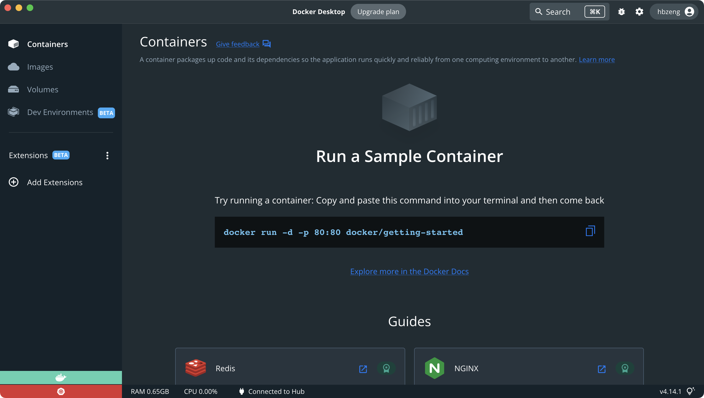

#### Docker 简介

##### 问题

我们希望有一个工具可以帮我们一键智能部署，假如你要部署在多台不同的机器上，
可以不用担心不同系统，不同版本的差异，以及运行之前需在安装不同软件的痛苦。

##### 解决

**当经的虚拟化软件：Docker https://www.docker.com**
**Docker 的进化**

* 传统虚机，虚拟硬件以后，需要在上面安装一个完整的操作系统
* Docker: 推出了容器概念，每个容器不需要安装完整操作系统，里面的
  进程直拉运行在Docker创造的宿主内核中，不需要虚拟硬件。

#### Docker 的优点

* 更快的启动速度
* 更少的资源占用
* 一致的运行环境
* 微服务架构，docker 天生适配微服务架构

#### 下载使用 Docker

** 下载地址：https://www.docker.com/products/docker-desktop**

