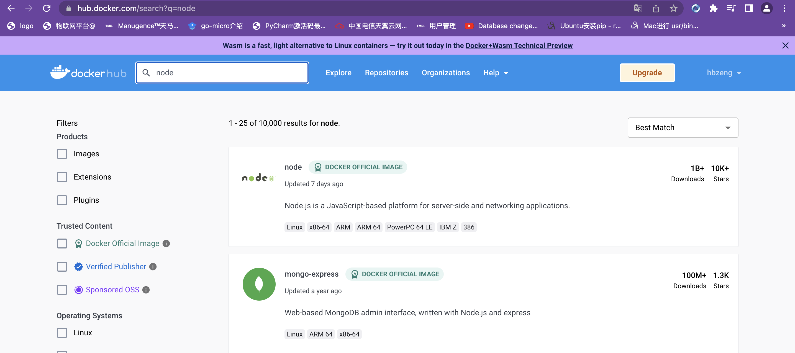

#### 这上面提供了hub.docker.com/search?q=type=image

#### 各种我们所需要官方或第三方的镜像文件。



**并助理可以上传人自己定义的镜像**

#### Docker镜像仓库获取镜像的命令是docker pull

```bash
# 下载镜像
docker pull <image-name>:<tag>
# 查看以及下载的镜像
docker images
# 删除镜像
docker rmi <image-id>
# 上传
docker push <username></repository>:<tag>
```

**使用镜像代理:**

```json
  "registry-mirrors": [
     "https://docker.mirrors.ustc.edu.cn",
     "https://reg-mirror.qiniu.com"
  ],
```
