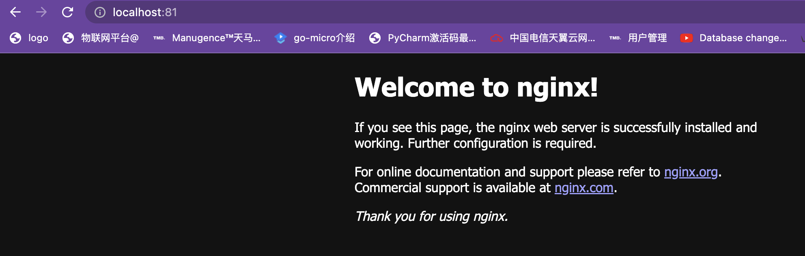
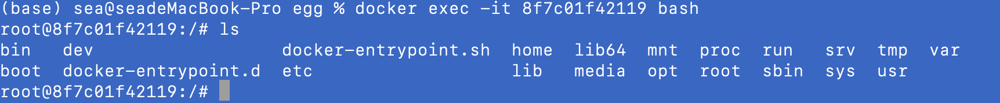

#### Docker Container

**启动Docker 容器**

```bash
docker run -d -p 81:80 --nmae container-name image-name
# -d 后出运行
# -p 端口映射 81 为主机的端口，80 为镜像中的端口
# --name 自定义容器名称
# image-name 镜像名称，假如本地没有下载，会自动 pull 一次镜像
```

**其他命令**

```bash
# 查看所有容器
docker ps
# 停止容器
docker stop container-id
```

#### 演示：

* docker run -d -p 81:80 nginx
  

**进入容器内部**

```bash
docker exec -it <container-id> command
-i : 即使没有附加也保持STDIN 打开
-t : 分配一个伪终端
```


