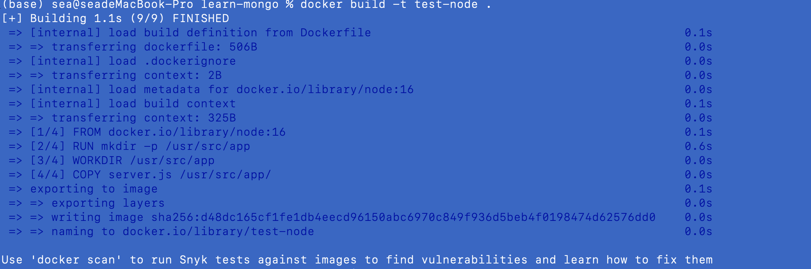
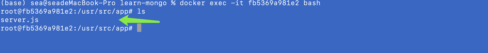

#### 使用Dockerfile 自定义镜像

**Dockerfile 是一个特殊的文本文件，里面包括一系例的指令，用来构建对应的镜像**

**所有指令**

https://docs.docker.com/engine/reference/builder/#from

```bash
# 指定基础镜像 从 node14 构建
FROM node: 14
# 创建对应的文件夹，作为项目运行的位置
RUN mkdir -p /usr/src/app
# 指定工作区，后面的运行任何命令都是在这个工作区中完成的
WORKDIR /usr/src/app
# 从本地拷贝对应的文件 到 工作区
```

#### 示例：

dockerfile

```
# 指定基础镜像 从 node16 构建
FROM node:16
# 创建对应的文件夹，作为项目的运行位置
RUN mkdir -p /usr/src/app
# 指定工作区，后面的运行任何命令都是在这个工作区中完成的
WORKDIR /usr/src/app
# 从本地拷贝对应的文件 到 工作区
COPY server.js /usr/src/app/
# 告知当前的Docker image 暴露的是 3000 端口号
EXPOSE 3000
# 执行启动命令， 一个 Dockerfile 只能有一个
CMD node server.js

```

#### 构建自定义的镜像

```bash
docker build -t test-node .
```



##### 查看构建的docker镜像

```bash
docker images
```

##### 启动

```bash
docker run -d -p 3000:3000 test-node
```

##### 查看docker 启动的容器镜像

```bash
docker ps
```

##### 进入到容器内部
```bash
docker exec -it fb5369a981e2 bash
```


**Docker build 构建自定义镜像**
```bash
# 这里特别注意上下文的概念，不要在根目录使用Dockerfile
docker build [选项] <上下文路径/URL/->
```
