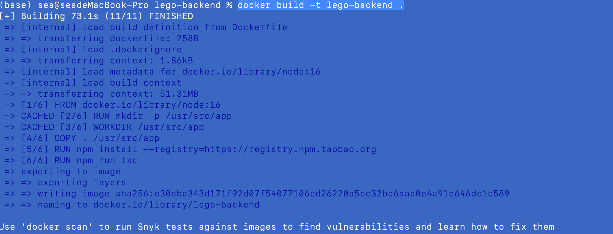
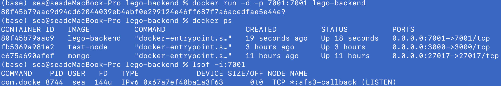
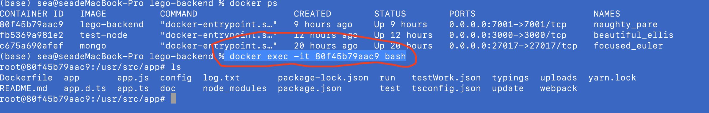

#### 1.修敢配置，将数据库mongodb及redis先不启用注释掉

```typescript
import { join } from 'path';
import { EggAppConfig, EggAppInfo, PowerPartial } from 'egg';
import * as dotenv from 'dotenv';

dotenv.config();
export default (appInfo: EggAppInfo) => {
  const config = {} as PowerPartial<EggAppConfig>;

  // override config from framework / plugin
  // use for cookie sign key, should change to your own and keep security
  config.keys = appInfo.name + '_1664866044287_6647';

  // add your egg config in here
  // 配置自己写的中间件
  // config.middleware = ['customError'];
  config.security = {
    csrf: {
      enable: false,
    },
    domainWhiteList: ['http://localhost:8080']
  };
  // 配置debug调试等级
  config.logger = {
    consoleLevel: 'DEBUG',
  };
  // 配置模板引擎插件
  config.view = {
    defaultViewEngine: 'nunjucks',
  };
  // 配置自定义插件
  // config.mongoose = {
  //   url: 'mongodb://localhost:27017/lego',
  //   options: {
  //     useCreateIndex: true,
  //     useUnifiedTopology: true,
  //   },
  // };
  config.bcrypt = {
    saltRounds: 10,
  };
  config.session = {
    encrypt: false,
  };
  config.jwt = {
    enable: true,
    secret: process.env.JWT_SECRET || '',
    match: [ '/api/users/getUserInfo', '/api/works', '/api/channel' ],
  };
  // config.redis = {
  //   client: {
  //     port: 6379,
  //     host: '127.0.0.1',
  //     password: '',
  //     db: 0,
  //   },
  // };
  config.multipart = {
    // mode: 'file',
    // tmpdir: join(appInfo.baseDir, 'uploads'),
    whitelist: [ '.png', '.jpg', '.gif', '.webp' ],
    fileSize: '100kb',
  };
  config.static = {
    dir: [
      { prefix: '/public', dir: join(appInfo.baseDir, 'app/public') },
      { prefix: '/uploads', dir: join(appInfo.baseDir, 'uploads') },
    ],
  };
  // config.cors = {
  //   origin: 'http://localhost:8080',
  //   allowMethods: 'GET,HEAD,PUT,OPTIONS,POST,DELETE,PATCH',
  // };
  // 阿里云对象存储
  config.oss = {
    client: {
      accessKeyId: process.env.ALC_ACCESS_KEY || '',
      accessKeySecret: process.env.ALC_SECRET_KEY || '',
      bucket: 'hblego-backend',
      endpoint: 'oss-cn-chengdu.aliyuncs.com',
    },
  };
  // gitee oauth config
  const giteeOauthConfig = {
    cid: process.env.GITEE_CID,
    secret: process.env.GITEE_SECRET,
    redirectURL: 'http://localhost:7001/api/users/passport/gitee/callback',
    authURL: 'https://gitee.com/oauth/token?grant_type=authorization_code',
    giteeUserAPI: 'https://gitee.com/api/v5/user',
  };
  // add your special config in here
  const bizConfig = {
    sourceUrl: `https://github.com/eggjs/examples/tree/master/${appInfo.name}`,
    myLogger: {
      allowedMethod: ['POST'],
    },
    // 发短信配置
    aliCloudConfig: {
      accessKeyId: process.env.ALC_ACCESS_KEY,
      accessKeySecret: process.env.ALC_SECRET_KEY,
      endpoint: 'dysmsapi.aliyuncs.com',
    },
    giteeOauthConfig,
    H5BaseURL: 'http://localhost:7001/api/pages',
    // 开发环境的失效时间为1个小时
    jwtExpires: '1h',
    // baseUrl: 'default.url',
    // jwt: {
    //   secret: '1234567890',
    // },
    // 配置mongoose的连接地址
    // mongoose: {
    //   url: 'mongodb://localhost:27017/hello',
    // },
  };

  // the return config will combines to EggAppConfig
  return {
    ...(config as {}),
    ...bizConfig,
  };
};
```

#### 2.将生产成H5的shape 插件暂时拿掉

```typescript
import { Controller } from 'egg';
// import sharp from 'sharp';
import sendToWormhole from 'stream-wormhole';
import Busboy = require('busboy');
import { join, extname } from 'path';
import { nanoid } from 'nanoid';
import { createWriteStream } from 'fs';
// import { pipeline } from 'stream/promises';
import { FileStream } from '../../typings/app';

export default class UtilsController extends Controller {
  splitIdAndUuid(str = '') {
    const result = { id: 0, uuid: '' };
    if (!str) return result;
    const firstDashIndex = str.indexOf('-');
    if (firstDashIndex < 0) return result;
    result.id = parseInt(str.slice(0, firstDashIndex));
    result.uuid = str.slice(firstDashIndex + 1);
    return result;
  }
  // SSR 服务端渲染H5页面
  async renderH5Page() {
    const { ctx } = this;
    const { idAndUuid } = ctx.params;
    const query = this.splitIdAndUuid(idAndUuid);
    try {
      const pageData = await this.service.utils.renderToPageData(query);
      await ctx.render('page.nj', pageData);
    } catch (error) {
      ctx.helper.error({ ctx, errorType: 'h5WorkNotExistError' });
    }
  }
  // 上传到阿里云oss
  async uploadToOSS() {
    const { ctx, app } = this;
    const stream = await ctx.getFileStream();
    // hblogo-backend/hb-iot/**.ext
    const savedOSSPath = join('hb-iot', nanoid(6) + extname(stream.filename));
    try {
      const result = await ctx.oss.put(savedOSSPath, stream);
      app.logger.info(result);
      const { name, url } = result;
      ctx.helper.success({ ctx, res: { name, url } });
    } catch (error) {
      await sendToWormhole(stream);
      ctx.helper.error({ ctx, errorType: 'imageUploadFail' });
    }
  }
  async uploadMutipleFiles() {
    const { ctx, app } = this;
    const { fileSize } = app.config.multipart;
    const parts = ctx.multipart({ limits: { fileSize: fileSize as number } });
    // { urls: [ xxx, xxx ]}
    const urls: string[] = [];
    let part: FileStream | string[];
    while ((part = await parts())) {
      // 如果是 string [] 文体就不做处理
      if (Array.isArray(part)) {
        app.logger.info(part);
      } else {
        try {
          const savedOSSPath = join(
            'hb-iot',
            nanoid(6) + extname(part.filename)
          );
          const result = await ctx.oss.put(savedOSSPath, part);
          const { url } = result;
          urls.push(url);
          if (part.truncated) {
            await ctx.oss.delete(savedOSSPath);
            return ctx.helper.error({
              ctx,
              errorType: 'imageUploadFileSizeError',
              error: `Reach filesize limt ${fileSize}`,
            });
          }
        } catch (error) {
          // 异常将part给销毁掉
          await sendToWormhole(part);
          ctx.helper.error({ ctx, errorType: 'imageUploadFail' });
        }
      }
    }
    ctx.helper.success({ ctx, res: { urls } });
  }
  uploadFileUseBusBoy() {
    const { app, ctx } = this;
    return new Promise<string[]>(resolve => {
      const busboy = new Busboy({ headers: ctx.req.headers as any });
      const results: string[] = [];
      busboy.on('file', (filedname, file, filename) => {
        app.logger.info(filedname, file, filename);
        const uid = nanoid(6);
        const savedFilePath = join(
          app.config.baseDir,
          'uploads',
          uid + extname(filename),
        );
        file.pipe(createWriteStream(savedFilePath));
        file.on('end', () => {
          results.push(savedFilePath);
        });
      });
      busboy.on('field', (fieldname, val) => {
        app.logger.info(fieldname, val);
      });
      busboy.on('finish', () => {
        app.logger.info('finished');
        resolve(results);
      });
      ctx.req.pipe(busboy);
    });
  }

  async testBsuBoy() {
    const { ctx } = this;
    // const results = await this.uploadFileUseBusBoy();
    const results = await this.uploadMutipleFiles();
    ctx.helper.success({ ctx, res: results });
  }

  // async fileLocalUpload() {
  //   const { ctx, app } = this;
  //   const { filepath } = ctx.request.files[0];
  //   // 生成 sharp 实例
  //   const imageSource = sharp(filepath);
  //   const metaData = await imageSource.metadata();
  //   app.logger.debug(metaData);
  //   let thumbnailUrl = '';
  //   // 检查图片宽度是否大于300
  //   if (metaData.width && metaData.width > 300) {
  //     // geterate a new file path
  //     // uploads/**/abc.png => uploads/** */abc-thumbnail.png
  //     const { name, ext, dir } = parse(filepath);
  //     app.logger.debug(name, ext, dir);
  //     const thumbnailFilePath = join(dir, `${name}-thumbnail${ext}`);
  //     app.logger.debug(thumbnailFilePath);
  //     await imageSource.resize({ width: 300 }).toFile(thumbnailFilePath);
  //     thumbnailUrl = thumbnailFilePath.replace(
  //       app.config.baseDir,
  //       app.config.baseUrl
  //     );
  //   }
  //   const url = filepath.replace(app.config.baseDir, app.config.baseUrl);
  //   ctx.helper.success({
  //     ctx,
  //     res: { url, thumbnailUrl: thumbnailUrl ? thumbnailUrl : url },
  //   });
  // }

  pathToURL(path: string) {
    const { app } = this;
    return path.replace(app.config.baseDir, app.config.baseUrl);
  }

  // async fileUploadByStream() {
  //   const { ctx, app } = this;
  //   // 获上传文件的文件流
  //   const stream = await ctx.getFileStream();
  //   // 取随机长度6位的uid
  //   const uid = nanoid(6);
  //   // 确定上传文件的图片路径
  //   const savedFilePath = join(
  //     app.config.baseDir,
  //     'uploads',
  //     uid + extname(stream.filename)
  //   );
  //   // 确定上传文件图片缩略图片路径
  //   const savedThumbnailPath = join(
  //     app.config.baseDir,
  //     'uploads',
  //     uid + '_thumbnail' + extname(stream.filename)
  //   );
  //   // 创建写上传图片的写入流
  //   const target = createWriteStream(savedFilePath);
  //   // 创建写上传图片缩略图的写入流
  //   const target2 = createWriteStream(savedThumbnailPath);
  //   /*
  //   // 用Promise方式来操作stream流读写操作
  //   const savePrommise = new Promise((resolve, reject) => {
  //     stream.pipe(target).on('finish', resolve).on('error', reject);
  //   });
  //   // 生成一个图片缩略图的转换流
  //   const transformer = sharp().resize({ width: 300 });
  //   // 让stream.pipe(到一个转换流中去).pipe(缩略图的可写流中)
  //   const thumbnailPromise = new Promise((resolve, reject) => {
  //     stream
  //       .pipe(transformer)
  //       .pipe(target2)
  //       .on('finish', resolve)
  //       .on('error', reject);
  //   });

  //   // 调用await 全部 Promise
  //   await Promise.all([ savePrommise, thumbnailPromise ]);
  //   */
  //   // 采用pipeline自带promise自写法
  //   const savePromise = pipeline(stream, target);
  //   const transformer = sharp().resize({ width: 300 });
  //   const thumbnailPromise = pipeline(stream, transformer, target2);
  //   try {
  //     await Promise.all([savePromise, thumbnailPromise]);
  //   } catch (e) {
  //     return ctx.helper.error({ ctx, errorType: 'imageUploadFail' });
  //   }
  //   // 最终返回上传图片URL 及 缩略图的 thumbnailUrl
  //   ctx.helper.success({
  //     ctx,
  //     res: {
  //       url: this.pathToURL(savedFilePath),
  //       thumbnailUrl: this.pathToURL(savedThumbnailPath),
  //     },
  //   });
  // }
}
```

#### 3.创建一个.dockerignore 文件

```
# Logs
logs
*.log
npm-debug.log*
yarn-debug.log*
yarn-error.log*
lerna-debug.log*

# Diagnostic reports (https://nodejs.org/api/report.html)
report.[0-9]*.[0-9]*.[0-9]*.[0-9]*.json
# Runtime data
pids
*.pid
*.seed
*.pid.lock
# Directory for instrumented libs generated by jscoverage/JSCover
lib-cov

# Coverage directory used by tools like istanbul
coverage
*.lcov

# nyc test coverage
.nyc_output

# Grunt intermediate storage (https://gruntjs.com/creating-plugins#storing-task-files)
.grunt

# Bower dependency directory (https://bower.io/)
bower_components

# node-waf configuration
.lock-wscript

# Compiled binary addons (https://nodejs.org/api/addons.html)
build/Release

# Dependency directories
node_modules/
jspm_packages/

# Snowpack dependency directory (https://snowpack.dev/)
web_modules/

# TypeScript cache
*.tsbuildinfo

# Optional npm cache directory
.npm

# Optional eslint cache
.eslintcache

# Microbundle cache
.rpt2_cache/
.rts2_cache_cjs/
.rts2_cache_es/
.rts2_cache_umd/

# Optional REPL history
.node_repl_history

# Output of 'npm pack'
*.tgz

# Yarn Integrity file
.yarn-integrity

# dotenv environment variables file


# parcel-bundler cache (https://parceljs.org/)
.cache
.parcel-cache

# Next.js build output
.next
out

# Nuxt.js build / generate output
.nuxt
dist

# Gatsby files
.cache/
# Comment in the public line in if your project uses Gatsby and not Next.js
# https://nextjs.org/blog/next-9-1#public-directory-support
# public

# vuepress build output
.vuepress/dist

# Serverless directories
.serverless/

# FuseBox cache
.fusebox/

# DynamoDB Local files
.dynamodb/

# TernJS port file
.tern-port

# Stores VSCode versions used for testing VSCode extensions
.vscode-test

# yarn v2
.yarn/cache
.yarn/unplugged
.yarn/build-state.yml
.yarn/install-state.gz
.pnp.*
.docker-volumes/
```

#### 编辑Dockerfile文件

```
FROM node:16
RUN mkdir -p /usr/src/app
WORKDIR /usr/src/app
COPY . /usr/src/app
RUN npm install --registry=https://registry.npm.taobao.org
RUN npm run tsc
EXPOSE 7001
CMD npx egg-scripts start --title=lego-backend
```

#### 用docker build -t lego-backend .



#### 创建容器并运行：

```
dockr run -d -p 7001:7001 lego-backend
```



#### 进入容器内部：

```
 docker exec -it 80f45b79aac9 bash
```


