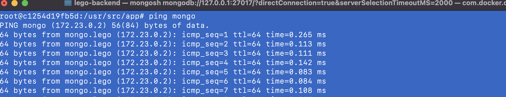

##### 多个容器互相通信

 **信条：Docker 中每一个container应该只完成一个工作，并且把它做好**

优点有：

* 解耦，这样不同的服务和后端代码都可完全分离开来，方便管理及未来的扩展。
* 服务的更新以及升级都是完全独立的。
* 在一个container中，启动多个不同的进程，需要一个进程管理器
  

##### 创建Docker network 网络, 让不同服务在同一个lego网络中运行进行通讯

* 1. 创建一个logo网络

```
docker network create lego
```

* 2. 让mongo 这个服务使用lego 这个网络

```
docker run -d --network lego --name mongo -p 27017:27017 mongo
```

* 3. 修改代码打开mongoose(config.default.ts)

```typescript
  config.mongoose = {
    url: 'mongodb://localhost:27017/lego',
    options: {
      useCreateIndex: true,
      useUnifiedTopology: true,
    },
  };
```

* 4. 在生产环境的配置中加上mongo的docker 网络配置（localhost=> mongo）

```
  config.mongoose = {
    url: 'mongodb://mongo:27017/lego',
    options: {
      useCreateIndex: true,
      useUnifiedTopology: true,
    },
  };
```

* 5. 重新构建lego-backend的image

```
docker build -t lego-backend .
```


* 6. 启动lego-backend 镜像，并设置为同一个lego 网络

```
dockrer run -d -p 7001:7001 --network lego lego-backend
```

* 7. 进入lego-backend 容器内部ping mongo 看是否连通。

  
