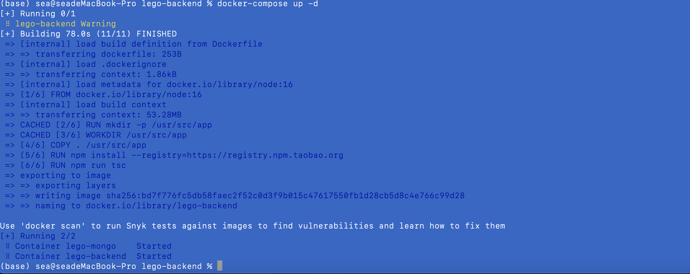

#### Docker compose

Docker compose 是Docker  官方推出的工具，用来管理和共享多容器的应用

**安装**

Mac 和 Windows 假安装客户端的话，是会自动安装Docker compose的

```
docker-compose version
```

Linux需在单独安装，文档在这里：https://docs.docker.com/compose/install

**配置**

docker compose 通过一个特殊的yml文件，进行配置，

***这个文件必须命名为docker-compose.yml***
docker-compose所有的字段参考文档：https://docs.docker.com/compose/compose-file/compose-file-v3

**编写docker-compose.yml**

```
version: '3'
services:
  lego-mongo:
    image: mongo
    container_name: lego-mongo
    volumes: 
      - '.docker-volumes/mongo/data:/data/db'
    ports:
      - 27017:27017
  lego-backend:
    depends_on:
      - lego-mongo
    build:
      context: . # 当前目录
      dockerfile: Dockerfile # 基于 Dockerfile 构建
    image: lego-backend
    container_name: lego-backend
    ports:
      - 7001:7001
```

**启动及关闭**

```
# 启动
docker-compose up -d
# 关闭
docker-compose down
```



注意因代码有修改，所以在构建之前需要将原来lego-backend 镜象删掉 再执行 docker-compose up -d
