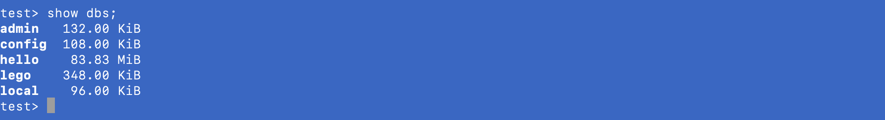

##### 1 添加mongodb root 最高权限用户

```
mongo
use admin   # 选择admin 数据库
db.createUsers({user: 'root', pwd:'123456', roles:['root']}) # 创建root用户
db.auth('root','123456') # 进行验证
exit # 退出
```

##### 2 重启mongo服务

```
(base) sea@seadeMacBook-Pro lego-backend % ps aux | grep mongo   
sea              54225   0.1  0.2 36492220  19136   ??  S     1:03下午   0:13.51 mongod --config /usr/local/etc/mongo.conf --auth
sea              56428   0.0  0.0 34122828    804 s000  S+    1:38下午   0:00.01 grep mongo
(base) sea@seadeMacBook-Pro lego-backend % kill 54225 # 杀掉进程

# mongod --config /usr/local/etc/mongo.conf
```

##### 3 登录mongo shell环境

```
mongo -u 'root' -p '123456' --authenticationDatabase "admin"
```


