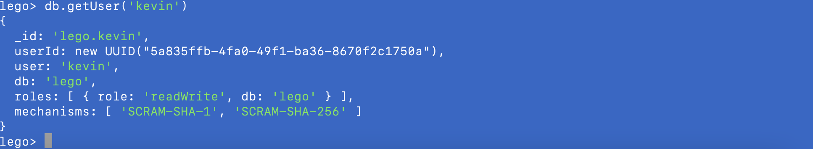
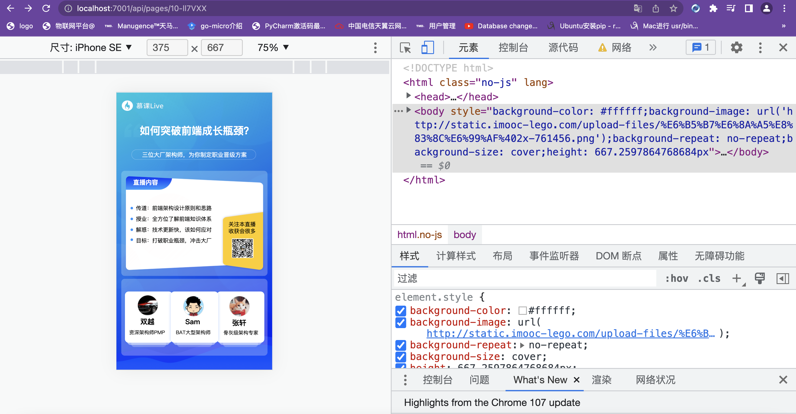

#### MongoDB 用户以及权限管理

授权文档: https://docs.mongodb.com/manual/core/authentication

内置的 Roles: https://docs.mongodb.com/manual/reference/build-in-roles

**初始化一个新的数据库以后，期望的步骤**

* 创建一个admin级别的root用户/role要：root
* 创建对应的数据库lego
* 创建该数据库的管理员xyz/roles: readWrite
* 代码中，使用管理员 xyz 用户名密码链接数据并且完操作。

```
mongo -u 'root' -p '123456' --authenticationDatabase 'admin'
```

```
use lego
db.createUser({user: 'kevin', pwd: '123456',roles:[{role:'readWrite',db:'lego'}]})
```


**修改代码：mongodb配置添加用户及密码**

```typescript
  // 配置自定义插件
  config.mongoose = {
    url: 'mongodb://localhost:27017/lego',
    options: {
      user: 'kevin',
      pass: '123456',
      useCreateIndex: true,
      useUnifiedTopology: true,
    },
  };
```

**在开发环境运行进测试：**

