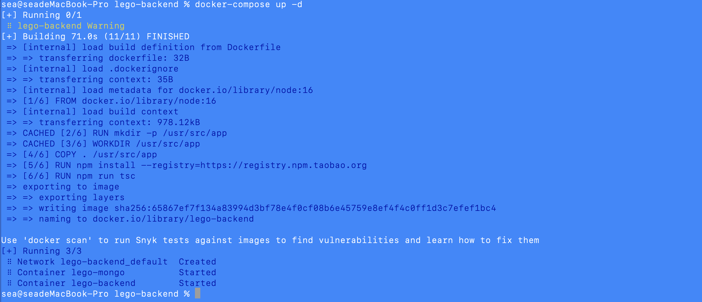
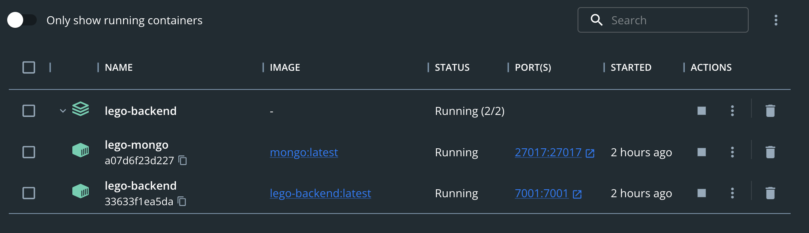

##### 1 在.env 文件上添加保存敏感信息

```
MONGO_INITDB_ROOT_USERNAME='admin'
MONGO_INITDB_ROOT_PASSWORD='pass'
MONGO_DB_USERNAME='user'
MONGO_DB_PASSWORD='pass'
```

##### 2在mongo-entrypoint目录，添加setup.sh 数据库初始化脚本

```shell
#!/bin/bash

# shell脚本中发生错误，即命令返回值不等于0，则停止执行并退出shell
set -e

mongosh <<EOF
use admin
db.auth('$MONGO_INITDB_ROOT_USERNAME', '$MONGO_INITDB_ROOT_PASSWORD')
use lego
db.createUser({
  user:'$MONGO_DB_USERNAME',
  pwd:'$MONGO_DB_PASSWORD',
  roles:[{
    role:'readWrite',
    db:'lego'
  }]
})
db.createCollection('works')
db.works.insertMany([
  {
    id: 19,
    title: '1024 程序员日',
    desc: '1024 程序员日',
    author: '185****2625',
    coverImg: 'http://static-dev.imooc-lego.com/imooc-test/sZHlgv.png',
    copiedCount: 737,
    isHot: true,
    isTemplate: true,
    isPublic: true,
    createdAt: '2020-11-26T09:27:19.000Z',
  }
])
EOF
```

##### 3 修改config.prod.ts生产环境配置文件，添加mongoose数据库 连接字符串

```typescript
  config.mongoose = {
    url: 'mongodb://lego-mongo:27017/lego',
    options: {
      user: process.env.MONGO_DB_USERNAME,
      pass: process.env.MONGO_DB_PASSWORD,
      useCreateIndex: true,
      useUnifiedTopology: true,
    }
  };
```

***注意需把config.default.ts中的mongoose配置注释掉***

##### 4 修改docker-compose.yml

```
version: '3'
services:
  lego-mongo:
    image: mongo
    container_name: lego-mongo
    volumes:
      - '.docker-volumes/mongo/data:/data/db'
      - '$PWD/mongo-entrypoint/:/docker-entrypoint-initdb.d/'
    ports:
      - 27017:27017
    env_file:
      - .env
  lego-backend:
    depends_on:
      - lego-mongo
    build:
      context: . # 当前目录
      dockerfile: Dockerfile # 基于 Dockerfile 构建
    image: lego-backend
    container_name: lego-backend
    ports:
     - 7001:7001
    env_file:
      - .env
```

##### 5 执行docker-compose up -d

```
docker-compose up -d
```




