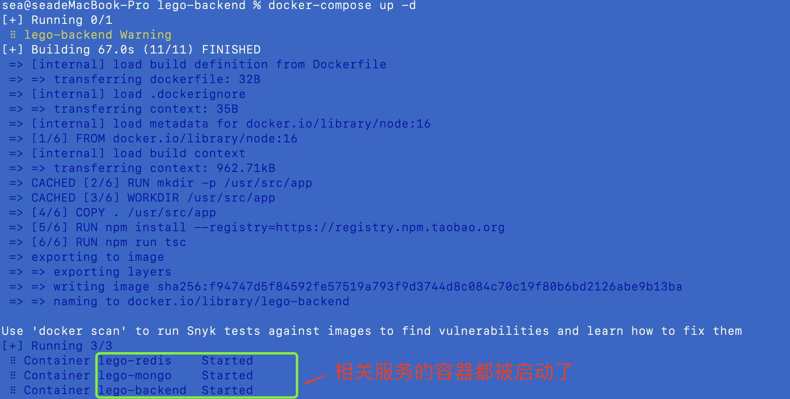
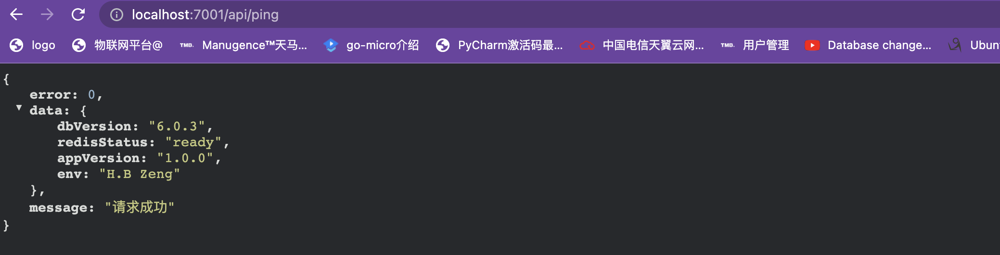

##### 1. 在config.prod.ts中添加redis的配置：

```
  config.redis = {
    client: {
      port: 6379,
      host: 'lego-redis',
      password: process.env.REDIS_PASSWORD,
      db: 0
    }
  }
```

##### 2.将之前在config.default.ts中注释掉的redis配置放开

```
  config.redis = {
    client: {
      port: 6379,
      host: '127.0.0.1',
      password: '',
      db: 0,
    },
  };
```

##### 3. 提前下载好redis的镜像

```
docker pull redis
```

##### 4.修改docker-compose.yml

```
version: '3'
services:
  lego-mongo:
    image: mongo
    container_name: lego-mongo
    volumes:
      - '.docker-volumes/mongo/data:/data/db'
      - '$PWD/mongo-entrypoint/:/docker-entrypoint-initdb.d/'
    ports:
      - 27017:27017
    env_file:
      - .env
  lego-redis:
    image: redis
    container_name: lego-redis
    command: >
      --requirepass ${REDIS_PASSWORD}
    ports:
      - 6379:6379
    env_file:
      - .env
  lego-backend:
    depends_on:
      - lego-mongo
      - lego-redis
    build:
      context: . # 当前目录
      dockerfile: Dockerfile # 基于 Dockerfile 构建
    image: lego-backend
    container_name: lego-backend
    ports:
     - 7001:7001
    env_file:
      - .env
```

##### 5 修改controller中的home.ts

```typescript
import { Controller } from 'egg';
import { version as appVersion} from '../../package.json';

export default class HomeController extends Controller {
  public async index() {
    const { ctx } = this;
    const { status } = ctx.app.redis;
    const { version } = await ctx.app.mongoose.connection.db.command({
      buildInfo: 1,
    });
    ctx.helper.success({
      ctx,
      res: {
        dbVersion: version,
        redisStatus: status,
        appVersion,
        env: process.env.PING_ENV,
      },
    });
  }
}
```

##### 6 修改路由router.ts

```typescript
  router.get('/ping', controller.home.index);
```

##### 7 执行docker-compose up -d



##### 8. 打开网页进行测试


