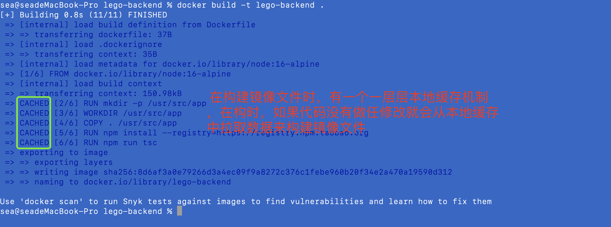
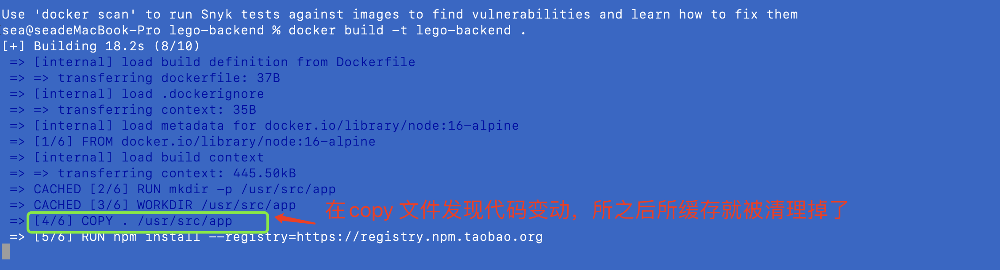
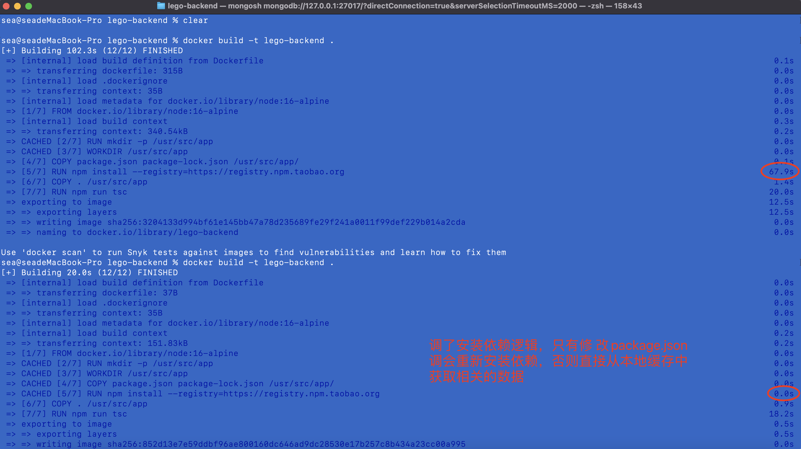

##### docker build -t xxx .



##### 我们即使改一点点代码，在构建时就会重装安装依赖



##### 修改Dcokerfile:

```
FROM node:16-alpine
RUN mkdir -p /usr/src/app
WORKDIR /usr/src/app
COPY package.json package-lock.json /usr/src/app/
RUN npm install --registry=https://registry.npm.taobao.org
COPY . /usr/src/app
RUN npm run tsc
EXPOSE 7001
CMD npx egg-scripts start --title=lego-backend
```


