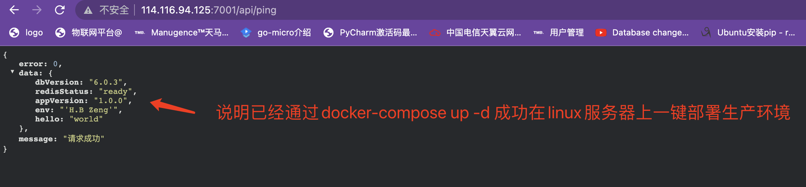
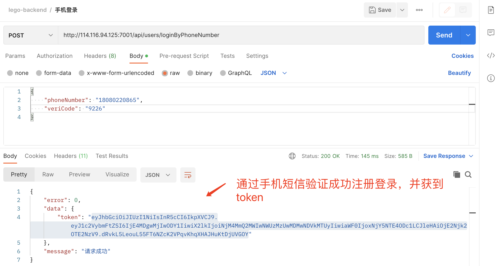
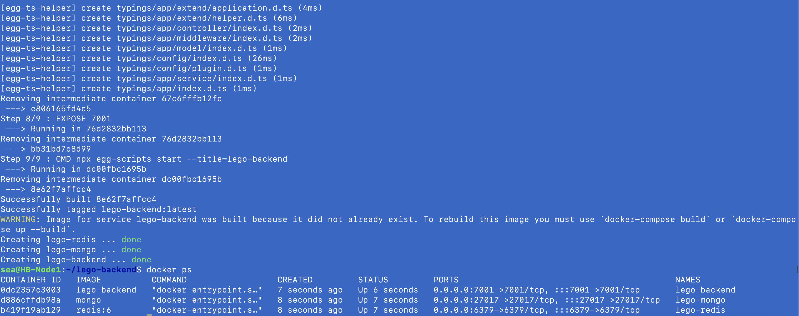

##### 部署到服务器

**安装Docker**

Ubutn:

* https://www.runoob.com/docker/ubuntu-docker-insall.html
* https://docs.docker.com/engine/install/ubuntu

**配置用户组**

因为是root安装，普通用户执行对应的命令的时候有可能会报错

Can't connect to docker daemon

Got permission denied while trying to connect to the Docker daemon

socket at unix:///var/run/docker.sock

需将将对应的用户添加到docker的用户组中。

```bash
# usermod 命令修改账户
# a --append 添加 - G --groups 组的名称
sudo usermod -aG docker 你的用户名
```

***特别注意***

环境变量，键值不需要单引号

```
ALC_ACCESS_KEY=LTAI5t9XmCHTvAwQyS9k6V1V
ALC_SECRET_KEY=tHgoDozyoIBdtMZy5X59ZVjDTpytx2

GITEE_CID=2e1f3ed8abb326398ccbea5306d6e9c981cba8559da3f8dead3c5fc1523486de
GITEE_SECRET=04b41896ea8b8b11046529a56b0a49fa372feede8b58770d235f4a06e1d58b19

JWT_SECRET=1234567890

MONGO_INITDB_ROOT_USERNAME=admin
MONGO_INITDB_ROOT_PASSWORD=pass
MONGO_DB_USERNAME=user
MONGO_DB_PASSWORD=pass

REDIS_PASSWORD=kevin22315

PING_ENV='H.B Zeng'
```

##### 测试发布后是否正常运行：






