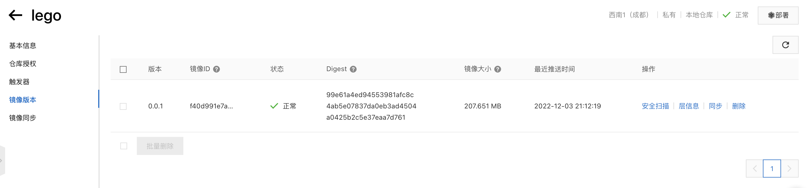

**推送镜像到ACR**

```bash
# 来到镜像仓库的基本信息页
# 登录
docker login --username=你的名称 registry.cn-chengdu.aliyuncs.com
# tag 两种方式： 1 使用 tag build
docker login --username=kevinhbzeng registry.cn-chengdu.aliyuncs.com/kevinhbzeng/lego:[镜像版本号]
# 2 给 build 好的打 tag
dokcer tag [ImageId] registry.cn-chengdu.aliyuncs.com/kevinhbzeng/lego:[镜像版本号]
# 查看镜像是否 build 完成
docker images
# 推送镜像
docker push registry.cn-chengdu.aliyuncs.com/kevinhbzeng/lego:[镜像版本号]
# 在阿里云 ACR 界面检查看是否已经存在
```


1. 登录阿里云Docker Registry
$ docker login --username=kevinhbzeng registry.cn-chengdu.aliyuncs.com
用于登录的用户名为阿里云账号全名，密码为开通服务时设置的密码。

您可以在访问凭证页面修改凭证密码。

2. 从Registry中拉取镜像
$ docker pull registry.cn-chengdu.aliyuncs.com/kevinhbzeng/lego:[镜像版本号]
3. 将镜像推送到Registry
$ docker login --username=kevinhbzeng registry.cn-chengdu.aliyuncs.com
$ docker tag [ImageId] registry.cn-chengdu.aliyuncs.com/kevinhbzeng/lego:[镜像版本号]
$ docker push registry.cn-chengdu.aliyuncs.com/kevinhbzeng/lego:[镜像版本号]
请根据实际镜像信息替换示例中的[ImageId]和[镜像版本号]参数。

4. 选择合适的镜像仓库地址
从ECS推送镜像时，可以选择使用镜像仓库内网地址。推送速度将得到提升并且将不会损耗您的公网流量。

如果您使用的机器位于VPC网络，请使用 registry-vpc.cn-chengdu.aliyuncs.com 作为Registry的域名登录。

5. 示例
使用"docker tag"命令重命名镜像，并将它通过专有网络地址推送至Registry。

$ docker images
REPOSITORY                                                         TAG                 IMAGE ID            CREATED             VIRTUAL SIZE
registry.aliyuncs.com/acs/agent                                    0.7-dfb6816         37bb9c63c8b2        7 days ago          37.89 MB
$ docker tag 37bb9c63c8b2 registry-vpc.cn-chengdu.aliyuncs.com/acs/agent:0.7-dfb6816
使用 "docker push" 命令将该镜像推送至远程。

$ docker push registry-vpc.cn-chengdu.aliyuncs.com/acs/agent:0.7-dfb6816
