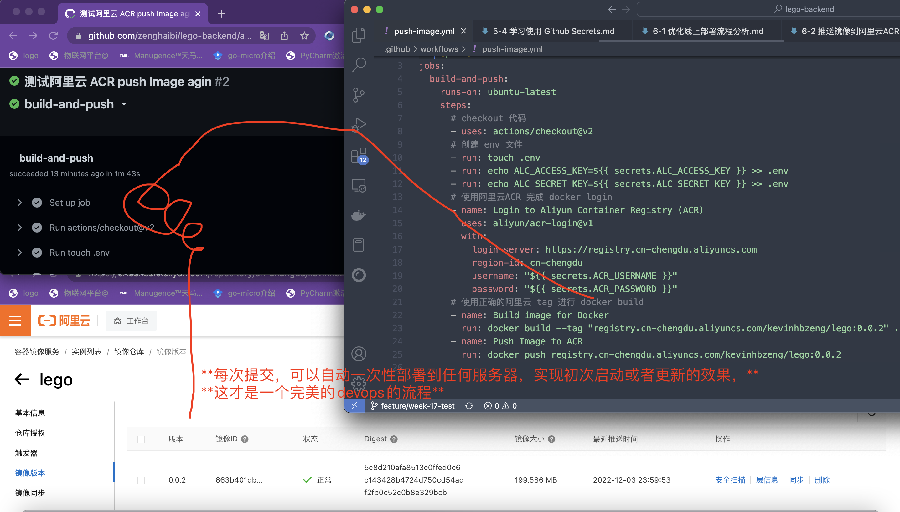

#### Github Actions 完成自动部署

**大体分为两步**

* 在runner 上 build image  并且push
* 使用docker-compose-online 文件在服务器上运行应用

**第一步详细流程分析，在gihub runner 上运行**

* checkout 代码
* 创建.env 文件，并且添加两个环境变量（upload to OSS 需要对应的信息）
* 使用阿里云ACR完成docker login
* 使用正确的阿里云tag进行docker build
  * 怎样每次push生成特殊的tag? 是一个后续的问题
* docker push

***提前准备好 Actions secrets***

* ACR_PASSWORD
* ACR_USERNAME. --->kevinhbzeng
* ALC_ACCESS_KEY
* ALC_SECRET_KEY

#### 编写push-image.yml 文件

```yaml
name: build image, push to ACR
on: [push]
jobs:
  build-and-push:
    runs-on: ubuntu-latest
    steps:
      # checkout 代码
      - uses: actions/checkout@v2
      # 创建 env 文件
      - run: touch .env
      - run: echo ALC_ACCESS_KEY=${{ secrets.ALC_ACCESS_KEY }} >> .env
      - run: echo ALC_SECRET_KEY=${{ secrets.ALC_SECRET_KEY }} >> .env
      # 使用阿里云ACR 完成 docker login
      - name: Login to Aliyun Container Registry (ACR)
        uses: aliyun/acr-login@v1
        with:
          login-server: https://registry.cn-chengdu.aliyuncs.com
          region-id: cn-chengdu
          username: "${{ secrets.ACR_USERNAME }}"
          password: "${{ secrets.ACR_PASSWORD }}"
      # 使用正确的阿里云 tag 进行 docker build
      - name: Build image for Docker
        run: docker build --tag "registry.cn-chengdu.aliyuncs.com/kevinhbzeng/lego:0.0.2" .
      - name: Push Image to ACR
        run: docker push registry.cn-chengdu.aliyuncs.com/kevinhbzeng/lego:0.0.2
```


