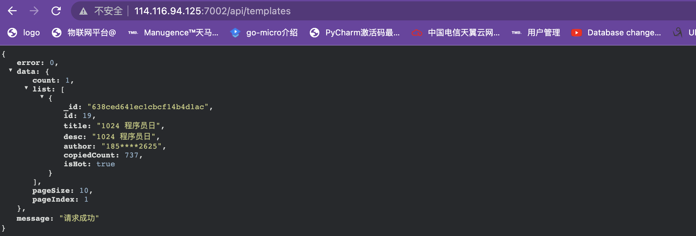

* SSH 到服务器中
  * 登录阿里云ACR
  * 进入拷贝的文件内
  * 停止服务 docker-compose down (第一次的话，没有启动也不会报错)
  * 启动服务 docker-compose up
  * 清理工作可选，保证安全（删除.env文件，登出docker账户）

```yaml

name: Deploy app to server
on: [push]
jobs:
  deploy-and-restart:
    runs-on: ubuntu-latest
    steps:
      # checkout 代码
      - uses: actions/checkout@v2
      # 创建 env 文件
      - name: 'create env file'
        run: |
          touch .env
          echo ALC_ACCESS_KEY=${{ secrets.ALC_ACCESS_KEY }} >> .env
          echo ALC_SECRET_KEY=${{ secrets.ALC_SECRET_KEY }} >> .env
          echo GITEE_CID=${{ secrets.GITEE_CID }} >> .env
          echo GITEE_SECRET=${{ secrets.GITEE_SECRET }} >> .env
          echo JWT_SECRET=${{ secrets.JWT_SECRET }} >> .env
          echo MONGO_INITDB_ROOT_USERNAME=${{ secrets.MONGO_INITDB_ROOT_USERNAME }} >> .env
          echo MONGO_INITDB_ROOT_PASSWORD=${{ secrets.MONGO_INITDB_ROOT_PASSWORD }} >> .env
          echo MONGO_DB_USERNAME=${{ secrets.MONGO_DB_USERNAME }} >> .env
          echo MONGO_DB_PASSWORD=${{ secrets.MONGO_DB_PASSWORD }} >> .env
          echo REDIS_PASSWORD=${{ secrets.REDIS_PASSWORD }} >> .env
          echo PING_ENV=${{ secrets.PING_ENV }} >> .env
      # 拷贝必须文件到一个文件夹，包括 .env, docker-compose-online.yml, mongo-entrypoint
      - name: 'copy necessary files in to one folder'
        run: |
          mkdir lego-backend
          cp .env docker-compose-online.yml lego-backend
          cp -r mongo-entrypoint lego-backend
          ls -a lego-backend
      # 通过 scp 拷贝必须文件到服务器
      - name: 'copy lego-backend folder via ssh'
        uses: appleboy/scp-action@master
        with:
          host: ${{ secrets.SSH_HOST }}
          username: ${{ secrets.SSH_USER }}
          key: ${{ secrets.KEY }}
          source: 'lego-backend'
          target: '~'
      # 通过 SSH 登录然后重启服务
      - name: executing ssh and restart docker
        uses: appleboy/ssh-action@master
        with:
          host: ${{ secrets.SSH_HOST }}
          username: ${{ secrets.SSH_USER }}
          key: ${{ secrets.KEY }}
          script_stop: true
          # * 登录阿里云 ACR
          # 停止服务 docker-compose down
          # 启动服务 docker-compose up
          # 清理工作
          script: |
            docker login --username=${{secrets.ACR_USERNAME}} --password=${{secrets.ACR_PASSWORD}} registry.cn-chengdu.aliyuncs.com
            cd ~/lego-backend
            docker-compose -f docker-compose-online.yml down
            docker-compose -f docker-compose-online.yml up -d
            rm -rf .env
            docker logout registry.cn-chengdu.aliyuncs.com
```

#### 测试服务是否开启:


