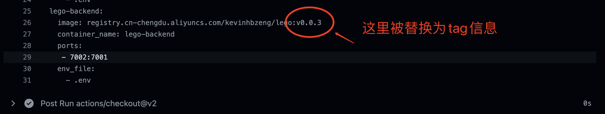

**结合两步之前要完成的任务**

* 不是每次commit都要构建并且部署上线的，只有特定的情况下，才会发布上线。
* 需要使用和该次提交相关特殊信息，作为构建image的时候的tag.
* 常见的发布是当main/master有提交或者merge的情况下，才会发布上线。
  还有最常用的是使用tag, 在travis，发布组件的时候也有所耳闻，tag是标记
  版本的最好实践。
* 可以使用提交的特殊标记作为构建镜像的tag,这里假如你选用tag发布，
  自然是选择对应的tag, 如果是其他情况可以选择commit的ID

**这节课的任务**

* 在push tags的时候才触发对应的job
* https://docs.github.com/cn/actions/learn-github-actions/events-that-trigger-workflows
* 怎样获取对应的每次提交的特殊信息

