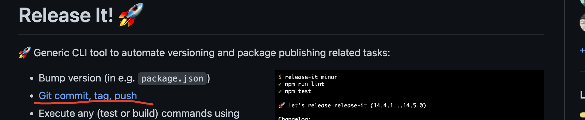

##### 使用Release-it 自动填写部署信息

现在我们的tag, 以及package.json 中信息，需要手动修改，费时而且容易出错，

我们使用一款工具一规范这个流程：Release-it

https://github.com/release-it/release-it



```bash
# 安装
npm install --save-dev release-it
# 在 package.json 中添加命令
"release": "release-it"
# 两种模式，一个是弹出用户输入模式，一个是ci 模式
```
